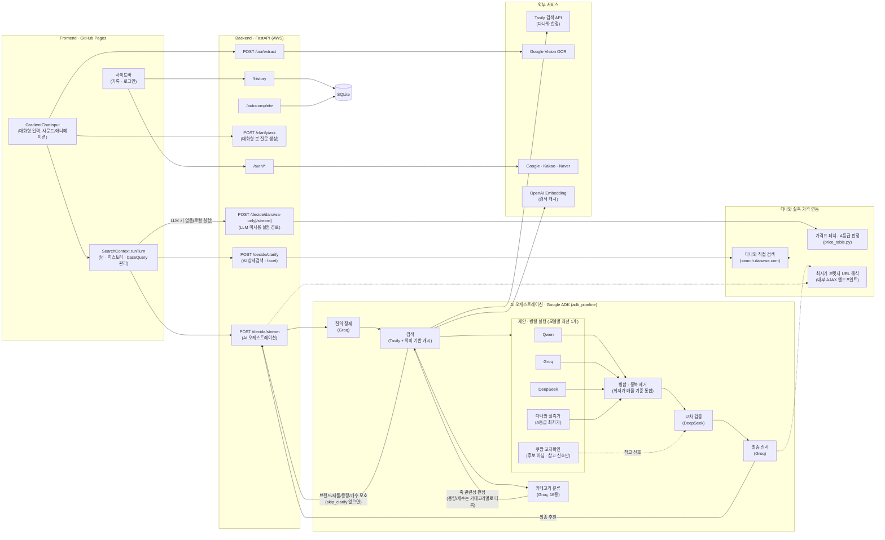
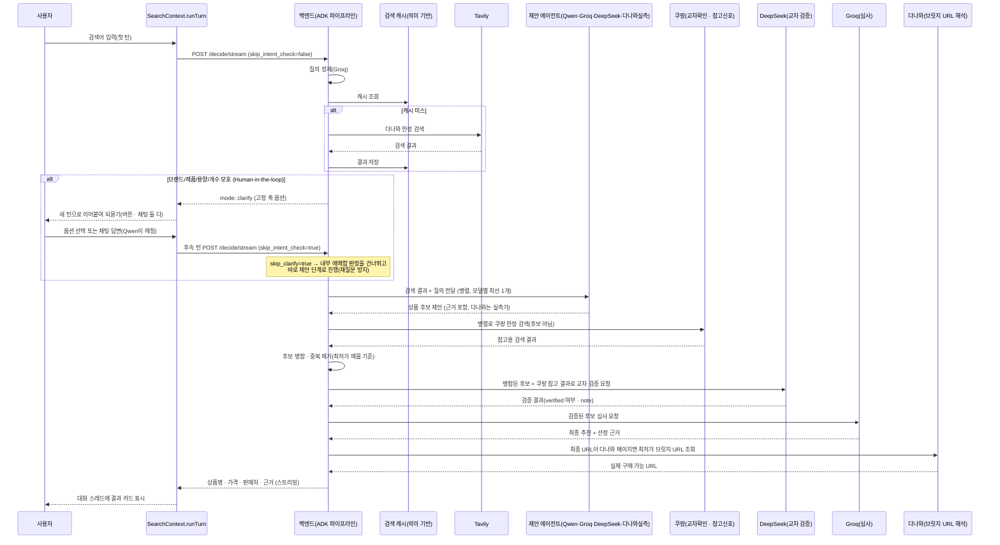
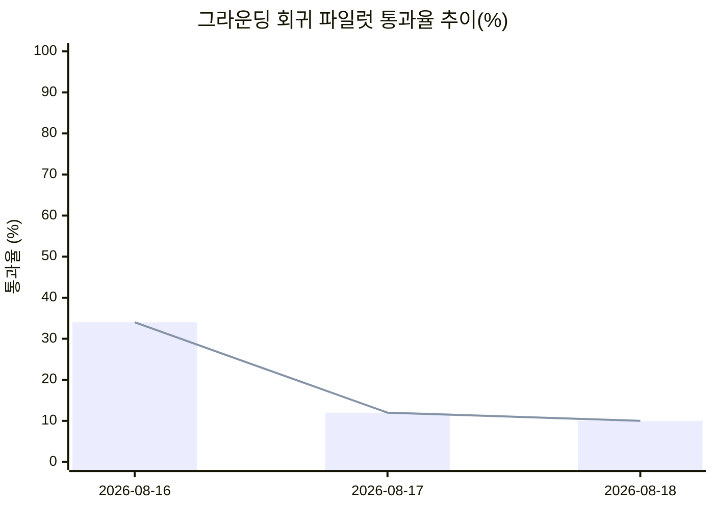

# αlpha Pick

alpha-pick-jet.vercel.app
---

## 1️⃣ 프로젝트 개요

### 프로젝트명 및 한 줄 소개

**αlpha Pick** — 하나의 검색어를 여러 AI 에이전트가 각자 조사해 제안하고, 별도의 심사 에이전트가 근거를 비교해 하나의 답으로 압축해주는 멀티에이전트 쇼핑 가격비교 서비스.

### 프로젝트 개요도

> 2026-08 통합 병합 이후 구조. 프론트는 GPT가 실시간으로 응답을 생성하는 대화형 멀티턴
> UI(`ChatTurn`)로, 백엔드는 ADK 기반 멀티에이전트 오케스트레이션과 다나와 실측 가격
> 연동을 함께 갖췄다. Human-in-the-loop 백엔드 추출 로직은 facet 기반 파이프라인
> 하나로 통합돼 있다(`/decide/clarify`·ADK 내부 안전망 공유). 그라운딩은 다나와
> 실측가 + 쿠팡 교차 확인 신호로 이중화돼 있다. 자세한 배경은
> [주요 의사결정 사항](#주요-의사결정-사항) 참고.

### 적용 기술 스택

| 영역 | 스택 |
| --- | --- |
| Frontend | React 18, Vite 6, TypeScript, Tailwind CSS v4, Framer Motion(`motion`), React Router (HashRouter) |
| Backend | FastAPI, Python, httpx, PyJWT |
| 멀티에이전트 오케스트레이션 | Google ADK(`SequentialAgent`/`ParallelAgent`), LiteLLM |
| AI / 제안 · 검증 · 심사 | Qwen(DashScope) · Groq(Llama) · DeepSeek — 병렬 제안(모델별 최선 1개) / DeepSeek — 교차 검증(challenge) / Groq(GPT-OSS) — 최종 심사(judge) |
| 검색 | Tavily Search API (다나와로 도메인 한정) + 임베딩 기반 의미 유사도 검색 캐시 |
| 다나와 실측 가격 연동 | 다나와 직접 검색/상세페이지 페치(`httpx` + `BeautifulSoup4`/`lxml`), 내부 AJAX 엔드포인트를 통한 최저가 판매처 브릿지 URL 해석 |
| Human-in-the-loop | DeepSeek가 상품명 목록에서 facet(라벨 자유, 상호 교차 필터링)을 추출 — `/decide/clarify`(다나와 직접 검색)와 ADK 파이프라인 내부 안전망(Tavily 결과) 두 진입점이 하나의 공유 추출 파이프라인을 씀. 되묻는 질문 문장은 Qwen이 실시간 생성(`/clarify/ask`) |
| 이미지 인식 | Google Cloud Vision (텍스트 추출) → Groq (정제 · 검색어 추출) |
| 인증 | Google / Kakao / Naver OAuth2 + JWT 기반 세션 |
| 저장소 | SQLite (검색 기록 · 자동완성 인덱스 · 검색 캐시) |
| 배포 | Docker, nginx, certbot, AWS GPU 인스턴스, nip.io(Backend) / GitHub Pages, Vercel(Frontend), GitHub Actions(CI) |

### 주제 선정 배경

쇼핑을 위해 여러 플랫폼 탭을 오가며 가격을 직접 비교해야 하는 번거로움에서 출발했다. 단순히 최저가를 나열하는 비교 서비스가 아니라, "왜 이 상품인지" 근거를 함께 제시하는 서비스를 목표로 했고, 하나의 LLM에만 의존할 경우 생기는 편향·환각 문제를 줄이기 위해 **여러 모델이 각자 조사해 제안하고, 별도 모델이 심사하는 멀티에이전트 구조**를 채택했다.

### 목표 및 기대효과

- 여러 쇼핑몰을 직접 비교하는 시간을 줄이고, 근거가 붙은 단일 추천으로 의사결정을 단순화
- 단일 모델 호출 대비, 여러 모델의 교차 검증을 통해 추천의 신뢰도를 높임
- 텍스트뿐 아니라 상품 사진(OCR)으로도 검색이 가능해 입력 장벽을 낮춤

### 팀원 구성 및 역할 분담

| 팀원 | 주요 역할 |
| --- | --- |
| parkminsung45 | 백엔드 멀티에이전트 토론 엔진, 검색 품질(Tavily 연동/필터링), 소셜 로그인, 배포(AWS/Docker/nginx), 프론트엔드 UI/UX 전반 |
| tmdals3000 | 검색어 자동완성(cold-start) 기능, 멀티턴 대화 기능 |
| lou0-ux | OCR 텍스트 추출 파이프라인(Google Vision + Groq 정제) |
| Seojeong Woo | 서버 인스턴스 관리 , 데이터베이스 구축, 리서치 |

### 시간순 변경 이력

날짜는 실제 커밋 기준(`git log`). 아래는 그날의 핵심만 압축한 타임라인이고,
"왜 그렇게 했는지"의 근거는 바로 아래 [주요 의사결정 사항](#주요-의사결정-사항)과
[문제 해결 내역](#문제-해결-내역-troubleshooting)에 항목별로 자세히 남아있다.

| 날짜 | 도입 / 변경 / 개선 |
| --- | --- |
| 2026-08-04 ~ 06 | Figma Make로 뽑은 포트폴리오 템플릿(Cherry-Pick)을 실 프로젝트 구조로 전환(→ Étiquette 리브랜드). FastAPI 백엔드 스캐폴딩 + GPT·Gemini·DeepSeek 멀티에이전트 구매 의사결정 엔진 최초 구현 |
| 2026-08-07 | Google·Kakao·Naver 소셜 로그인, 계정별 검색 기록 사이드바, OCR(Google Vision + Gemini 정제) 이미지 검색 파이프라인 추가. 검색 소스를 네이버쇼핑 → Google Merchant Center로 교체. AWS GPU 인스턴스 + nip.io 기반 배포 최초 구축 |
| 2026-08-08 ~ 09 | "How We Curate"(멀티에이전트 토론 흐름 설명) 섹션, README 프로젝트 리포트 섹션 신설 |
| 2026-08-10 | 다나와 실측 가격 어댑터 최초 구현(판매처별 가격표 파싱, STEP 1~5 라이브 검증) · 쿼리 정규화 검색 캐시 도입 · `fusion.dedup` 후보 병합 가드(가격 호환성 + 이름 유사도) 추가 · Étiquette → αlpha Pick 리브랜드 |
| 2026-08-11 | 다나와 A등급(구매 링크 생성 가능) 후보를 judge 풀에 직접 승격(PART 4-2) · 동일 상품 판정 기준을 판매처+가격 → 상품명으로 전환(STEP 6) · **Google ADK 기반 역할 분리 멀티에이전트 파이프라인 + 의미 기반 검색 캐시 도입(현재 아키텍처의 골격)** · Human-in-the-loop 최초 도입 |
| 2026-08-12 | 카테고리 기반 HITL 축 최적화(Gemini 16종 분류로 용량/개수 관련성 판정) · 다나와 최저가 URL 해석(브릿지 엔드포인트) + 대화형 HITL(LLM이 되묻는 문장 생성) 추가 |
| 2026-08-13 | "gpt" 에이전트 슬롯을 OpenAI → Qwen(DashScope)으로 전환 · 완전 무관 후보뿐일 때의 relaxed fallback 최초 추가 · ChatGPT식 멀티턴 대화 스레드(`ChatTurn`)로 프론트 전환 · `skip_clarify`로 재질문 반복 버그 수정 · 죽은 코드/미사용 npm 의존성 1차 정리 |
| 2026-08-14 | Gemini·Claude → Groq 무료 API 전면 전환 · `/decide/clarify`와 ADK 내부 안전망의 facet 추출 로직 통합 · "용기형태" facet 구매유형 오분류 수정 · 쿠팡 교차 확인(challenge 3번째 그라운딩 신호) 추가 · 깨진 쿠팡 구매링크 노출 버그 3건(연쇄 원인) 수정 · 액세서리(핸드폰 케이스 등) 검색 품질 개선 · 대규모 죽은 코드 정리 · README 대폭 갱신 |
| 2026-08-16 | relaxed fallback을 challenge 재검증으로 게이팅해 하드닝(그라운딩 우회 경로 차단) · `Decision.verified` 필드 추가로 최종 응답의 그라운딩 검증 여부를 API 전체에 노출 · 네이버쇼핑을 쿠팡과 동일 패턴의 2번째 소프트 교차 확인 소스로 추가 · 알려진 상품 세트 기반 그라운딩 정확도 회귀 스크립트(`scripts/grounding_regression.py`) 추가 · 다나와 실측가 후보에 검색어 관련성 가드 추가(아이폰→아이패드 오추천 버그 수정) · facet crossfilter로 이미 좁혀진 축은 되묻지 않도록 수정(불필요한 clarify 다발 버그) · 다나와 가격비교 페이지 자체를 최종 후보로 받아들이던 버그 수정 |
| 2026-08-17 | 다나와 가격비교 페이지 필터를 도메인 기반으로 일반화(모바일 URL 변형 누락 대응) · 그라운딩 회귀 스크립트에 실행 전 제공자 헬스체크 + 도중 연속 실패 시 즉시 중단 안전장치 추가 · README에 그라운딩 회귀 실험 이력을 표+그래프로 자동 갱신하는 기능 추가 · 배포 저장소를 Prototype-1- 하나로 일원화(구 Alpha-pick00.github.io가 비공개/개명되며 배포 대상에서 제외, Pages 활성화 + 누락 환경변수 설정 + 죽은 배포 터널 재기동) · 안전장치의 쿼터 소진 감지가 파이프라인 내부 예외 삼킴에 뚫리는 문제 발견 후 문자열 매칭 → 연속 실패 기반 헬스체크 재확인 방식으로 재설계 |
| 2026-08-18 | 배포 터널 재소진 + 구 GitHub Pages URL 404 확인 후 터널 재기동·`VITE_API_URL` 갱신·재배포로 복구 · "gemini" 슬롯 기본 Groq 모델을 llama-3.3-70b-versatile → gpt-oss-20b로 교체(TPD 소진 회피) · 프론트엔드를 Vercel에도 배포하고 백엔드를 기존 AWS 인스턴스에 최신 코드로 재배포(저장소 재동기화, nginx+TLS를 새 인스턴스 IP로 재발급), CORS에 Vercel 도메인 추가 |

### 주요 의사결정 사항

- **검색 데이터 소스**: Google Merchant API는 자사 등록 상품만 조회 가능해 제3자 가격 비교에 부적합하다고 판단, **Tavily 검색 API + 국내 리테일러 15곳 도메인 한정**으로 전환
- **판단 구조**: 단일 모델 호출 대신 **ChatGPT · Gemini · DeepSeek 3개 모델이 병렬로 제안 → Claude가 근거를 심사**하는 4단계 구조 채택
- **Google 로그인 방식**: 공식 렌더 버튼(iframe)은 Kakao/Naver와 스타일을 맞추기 어려워, `google.accounts.oauth2` 토큰 클라이언트 팝업 방식 + 커스텀 버튼으로 전환
- **CORS 정책**: 인증이 필요 없는 API이지만, 유료 LLM 호출 비용이 드는 만큼 origin을 알려진 도메인으로만 제한(와일드카드 금지)
- **검색 기록 저장**: 로그인 시 계정별 서버(SQLite) 저장, 비로그인 시 브라우저 로컬(localStorage) 저장으로 분기
- **판단 구조 재설계(역할 분리형 에이전트 체인)**: 멘토 피드백(데이터 신뢰도 · 토론/지연시간 구조)을 반영해, 한 번의 호출로 검색부터 추천까지 처리하던 구조를 Google ADK 기반의 **정제 → 검색 → 제안(3모델 병렬, 모델별 최선 1개) → 병합 → 교차 검증 → 심사** 단계로 명시적으로 분리
- **후보 병합 기준**: 여러 모델이 제안한 동일 상품 후보를 병합할 때 가격 · 판매처 · URL을 필드별로 각각 다수결 처리하면 서로 다른 상품의 필드가 섞일 수 있어, **하나의 최저가 매물(cheapest member) 기준으로 가격 · 판매처 · URL을 함께** 채택하도록 변경 — 최종 추천이 항상 실제로 그 가격에 구매 가능한 하나의 URL을 가리키도록 보장
- **Human-in-the-loop 도입 방식**: ADK 내부 pause/resume(`long_running_tool_ids` + `FunctionResponse` 재주입)은 커스텀 `BaseAgent` 구조에서 검증되지 않고 세션 영속화가 필요해 리스크가 크다고 판단, 대신 **앱 레벨에서 파이프라인을 완전히 무상태로 나눠 재실행**하는 방식을 채택(별도 세션 저장소 불필요) — 검색 직후 브랜드 · 제품 · 용량 · 개수가 모호하면 파이프라인을 멈추고, 사용자에게 한 축씩 되물어 이미 답한 조건은 다시 묻지 않는다
- **카테고리 기반 HITL 축 최적화**: "음료가 아닌 식품에도 용량을 묻는다" 같은 무의미한 질문이 상품 매핑 정확도를 떨어뜨려, Gemini로 검색어를 16개 대분류로 분류하고 카테고리별로 용량 · 개수 축의 관련성을 다르게 판정하도록 개선(예: 식품 중 음료만 용량이 유효, 도서는 용량 없이 개수만 유효) — clarify 단계에서만 호출해 지연시간 영향 최소화
- **다나와 실측 가격 직접 연동**: LLM이 제안한 가격 · URL은 검색 스니펫 기반 추정이라 오차가 있을 수 있어, 다나와 검색결과/상세페이지를 직접 페치해 A등급(구매 링크 생성 가능) 판매처 실측가를 별도로 확보 — 최종 추천이 다나와 데이터와 대조 가능하면 `price_source`를 `danawa_offer`로 표시해 신뢰도를 구분
- **다나와 가격비교 페이지 → 실제 구매 URL 변환**: 다나와 상세페이지 자체는 여러 판매처를 나열만 할 뿐 바로 구매할 수 있는 곳이 아니어서(`/bridge/loadingBridge.html?cmpnyc=...`), 최종 응답 URL이 다나와 페이지면 서버가 내부 AJAX 엔드포인트(`getAllPriceCompareMallList.ajax.php`)로 최저가 판매처 브릿지 URL을 조회해 바꿔치기
- **검색 도메인 15곳 → 다나와로 축소**: 15개 리테일러 각각 페이지 구조가 달라 스니펫만 보고 파싱하면 엉뚱한 상품 · 가격이 섞이는 문제가 있었음 — 다나와는 그 자체로 여러 판매처 가격을 한 페이지에서 비교해주는 가격비교 사이트라 도메인을 좁혀 일관성 · 정확도를 우선함(한때 이중화 목적으로 에누리를 함께 검색 범위에 넣었으나, 어댑터 없이 노출만 되던 상태라 최종적으로 비교 대상에서 제외)
- **Human-in-the-loop 이원화(고정 축 + AI 상세검색 facet)**: 두 팀이 각자 발전시킨 clarify 방식(카테고리 기반 고정 4축 · GPT / 다나와 검색 결과 기반 동적 facet · DeepSeek, 상호 교차 필터링)이 서로 다른 강점을 가져 하나를 버리지 않고 병행 — 짧고 애매한 검색어는 먼저 AI 상세검색(facet)을 시도하고, facet이 못 찾으면 AI 오케스트레이션 내부의 고정 축 clarify로 폴백
- **대화형 UI로 통합(멀티턴 `ChatTurn`)**: 첫 검색어부터 이후의 모든 되묻기 · 재검색까지 하나의 성장하는 대화 스레드로 보이도록 프론트를 `ChatTurn` 배열 기반으로 재구성 — 브랜드/facet/고정 축 선택은 전부 새 턴을 만드는 방식으로 통일하고, 봇의 질문 · 답장은 고정 문구가 아니라 GPT가 매번 실제로 생성
- **AI 오케스트레이션과 다나와 통합의 병합**: 같은 기능(멀티에이전트 토론 + 다나와 연동 + HITL + 대화형 UI)을 두 갈래로 독립 개발한 뒤 병합하면서, ADK 파이프라인을 정식 오케스트레이션으로 유지하고 다나와 후보를 judge 풀에 직접 주입하는 직접-구현 경로는 `run_single_debate_price_table_variant`로 보존만 해두고 아직 ADK 파이프라인에 이식하지 않음(후속 과제) — 병합 도중 실제 구동 테스트에서 "이미 답한 축을 다시 묻는" 회귀를 발견해 `skip_clarify` 플래그로 즉시 수정
- **"gpt" 슬롯을 GPT → Qwen으로 교체**: OpenAI 토큰이 소진돼 `agents/gpt.py`가 호출하는 실제 모델을 DashScope(Alibaba Cloud) 기준 최상위 모델인 Qwen으로 바꿈 — `agent="gpt"`라는 내부 식별자(스키마의 `AgentName` 리터럴, 프론트엔드 타입, 테스트 픽스처 등 수십 곳에 걸침)는 그대로 두고 내부에서 호출하는 모델만 교체(파일명·함수명도 유지, `AsyncOpenAI` SDK를 DashScope의 OpenAI 호환 엔드포인트로 base_url만 바꿔 재사용 - `agents/deepseek.py`와 동일한 패턴). 사용자에게 보이는 이름만 프론트엔드 `AGENT_LABEL`에서 "Qwen"으로 변경. `openai_api_key`는 임베딩 기반 검색 캐시에서만 계속 쓰임
- **Gemini · Claude → Groq(무료 API)로 교체**: Gemini 프로젝트가 403으로 막히고 Anthropic엔 상시 무료 티어가 없어, DeepSeek/Qwen을 뺀 나머지 전부를 무료 API인 Groq로 전환 — `agent="gemini"` 식별자와 `agents/gemini.py`/`agents/judge.py` 파일·함수명은 그대로 두고 호출 모델만 교체(Qwen 때와 동일한 패턴). 역할별로 다른 모델을 쓰는데, ADK의 구조화 출력(`output_schema`→`response_format=json_schema`)을 지원하는 모델이 Groq 카탈로그에 `gpt-oss` 계열뿐이라 refine(작은 프롬프트)은 `gpt-oss-20b`, judge(그보다 큰 프롬프트 · 최종 심사)는 `gpt-oss-120b`를 쓰고, 구조화 출력이 필요 없는 categorize/OCR정제/propose의 "gemini" 슬롯은 무료 티어 분당 토큰(TPM) 한도가 가장 넉넉한 `llama-3.3-70b-versatile`을 쓴다 — `groq/compound(-mini)`는 TPM은 넉넉했지만 내부적으로 여러 모델에 요청을 위임하는 에이전틱 모델이라 하위 모델 rate limit을 그대로 물려받아 오히려 더 자주 실패해 제외. 검색 결과 12건을 그대로 프롬프트에 넣으면(Tavily 스니펫 건당 최대 1500자) 이 TPM 한도를 매번 초과해, `format_results_block`이 스니펫을 500자로 잘라 담도록 함께 수정(Qwen/DeepSeek 쪽 프롬프트 비용도 동반 절감)
- **다나와 A등급 실측가 주입을 ADK 파이프라인으로 포팅**: `run_single_debate_price_table_variant`(PART 4-2)에만 있던 "다나와 실측가를 judge 후보 풀에 직접 추가"를 라이브 파이프라인(`adk_pipeline`)에 이식 — `_DanawaFetchNode`를 gpt/gemini/deepseek와 같은 `ParallelAgent`(propose) 소속으로 추가해 동시 실행되게 하고(지연시간 추가 없음), 그 결과를 다른 3개 슬롯과 동일한 raw JSON 모양으로 만들어 기존 `_merge_proposals`/`merge_candidates`에 그대로 태워 `proposed_by` 합의 신호도 같이 얻는다(레거시처럼 별도 merge를 다시 안 돌림). 다나와 데이터는 이미 실측 검증된 값이라 DeepSeek 텍스트 검증에 다시 맡기지 않고, 병합된 후보의 `proposed_by`에 `"danawa"`가 있으면 `_apply_challenge`가 verified를 무조건 True로 강제한다. judge 확정 후에는 `enrich_decision`/`exclude_price_comparison_site_as_final_pick`을 그대로 재사용해 이름이 맞으면 실측가로 덮어쓰고, 최종 URL이 다나와 가격비교 페이지 자체면 치환한다 — 이 작업 전까지 `DecideResponse.price_table`은 라이브 경로에서 항상 null이었다.
- **clarify 백엔드 추출 로직을 facet 하나로 통합(백엔드 한정)**: 고정 4축(브랜드/제품/용량/개수, Qwen이 Tavily 결과에서 추출)과 AI 상세검색 facet(라벨 자유, DeepSeek이 다나와 검색 결과에서 추출)이 서로 다른 진입점에서 독립적으로 동작하던 걸, `adk_pipeline`의 내부 안전망 clarify(`_extract_clarify_options`)가 `/decide/clarify`(`check_clarify_facets`)와 같은 facet 추출 파이프라인(`_extract_facets`)을 쓰도록 통합 — 입력만 다르게 유지한다(`check_clarify_facets`는 다나와 직접 검색, `_extract_clarify_options`는 이미 갖고 있는 Tavily 검색 결과 제목을 그대로 써서 네트워크 호출을 늘리지 않음). 프론트가 이미 facet 렌더링(교차 필터링·검색창·페르소나 배지)을 완전히 지원해서 프론트엔드 변경 없이 바로 가능했다 - 프론트의 `FixedAxisClarifyCard`/브랜드 전용 버튼 블록/`/clarify/ask` 대화형 질문까지 건드리는 완전한 UI 수준 통합은 범위 밖으로 명시적으로 남겨뒀다(체감 UX가 바뀌는 결정이라 사용자 판단이 필요해서). 고정 4축 전용이던 `_strip_resolved_options`/`_resolved_dimension_count`/`_is_ambiguous`(adk_pipeline.py)는 facet 버전(`_strip_resolved_facets`/`_resolved_facet_count`/`_is_ambiguous_facets`, 전부 debate.py)으로 교체하고 원본은 삭제했다. 카테고리 기반 축 관련성 필터링(`_strip_category_irrelevant_options`)은 facet 추출 프롬프트 자체가 이미 의미 있는 축만 뽑도록 유도한다고 판단해 이번엔 옮기지 않고 함수만 보존(`PRESERVED FROM seungmin/lsm` 주석) - 라이브에서 무의미한 facet이 실제로 섞여 나오면 후속 작업으로 라벨 패턴 매칭 버전을 추가한다.
- **facet 크로스필터를 하이퍼그래프 incidence 구조로 재구성**: `_attach_facet_crossfilter`는 사실상 이미 하이퍼그래프였다 - 상품 하나(하이퍼엣지)가 브랜드·시리즈·용량 같은 여러 facet 값(정점)을 동시에 묶는데, 이걸 facet 쌍마다 선택지 값마다 상품명 전체를 매번 재스캔하는 브루트포스로 계산했다. `_build_facet_value_incidence`(facet 값 -> 등장하는 상품 인덱스 집합)를 한 번만 만들어, "같은 상품에 같이 등장하는가" 판정을 집합 교집합 유무로 바꿨다 - 원래 판정과 수학적으로 동치라 `options_by_selection` 결과는 그대로다(기존 테스트로 검증). 이 incidence를 재사용해 `_facet_centrality`(평균 degree)로 `_FACET_ORDER_HINTS`가 못 잡는 facet들의 정렬을 LLM이 낸 임의 순서 대신 "다른 값들과 얼마나 폭넓게 공존하는가" 기준으로 다시 가른다 - 단, 힌트가 이미 잡은 facet(카테고리/브랜드/용량 등)은 중심성을 아예 안 본다(표본이 작은 질의에서 통계적 신호가 약해질 위험을 원천 차단, `_facet_sort_key`). numpy 등 새 의존성 없이 순수 `set` 연산으로 구현 - 표본 규모(다나와 직접검색 상한 ~20~30개, Tavily 상한 12개)에서 충분히 빠르다.
- **사용하지 않는 코드 일괄 정리**: 병합 과정에서 "나중에 필요할 수도" 있어 보존만 해두고 실제로는 어디서도 안 불리는 코드가 누적돼 있어 전수 조사 후 제거했다. (1) 레거시 직접-구현 경로 `run_single_debate_price_table_variant`(그 전용 헬퍼 `_top_proposal`, `agents/gpt.py`·`gemini.py`·`deepseek.py`의 `propose()`, `agents/judge.py`의 `decide()`/`LEGACY_JUDGE_INSTRUCTIONS`, `price_table.build_danawa_candidates`)는 다나와 실측가 주입이 `adk_pipeline`으로 포팅된 뒤(위 항목) 자기 테스트 말고는 어디서도 안 불렸다 - 여전히 살아있는 `pick_primary`/`enrich_decision`/`exclude_price_comparison_site_as_final_pick` 등은 그대로 둔다. (2) 고정 4축 전용 `_strip_category_irrelevant_options`(위 facet 통합 항목에서 "보존만" 해둔 그 함수) - facet 추출 프롬프트가 이미 그 역할을 대신한다고 판단해 최종 제거. (3) `intent.has_count_spec`/`has_volume_spec` - 호출자가 아예 없었다(정규식 자체는 `BULK_SPEC_PATTERN`에 합쳐져 여전히 쓰인다). (4) `fetchers/danawa.with_total_mall_count` - "N몰" 총 판매처 수를 상세페이지 결과에 병합하는 함수인데, 추출(`danawa_search._extract_total_mall_count`)만 있고 실제 파이프라인 어디에도 병합 호출이 없어 `PriceTable.total_mall_count`가 라이브에서 항상 None이었다 - `build_price_table`의 `is_partial`/`price_label` 분기 자체(입력만 주어지면 정상 동작)는 남겨뒀다. (5) `price_table.py`의 도달 불가능한 중복 `return decision` 한 줄. (6) 프론트: `/demo/gradient-chat-input` 라우트와 그 전용 shadcn/ui 스캐폴드(`components/ui/*` 전체, `GradientChatInputDemo.tsx`) - 지금 `Hero.tsx`에 내장된 검색창 이전의 프로토타입으로 보이며 어떤 내비게이션에서도 연결되지 않았다(그 전용 npm 의존성 `@radix-ui/react-slot`/`class-variance-authority`/`clsx`/`tailwind-merge`도 함께 제거). (7) `api.ts`의 `decideDanawaOnlyStream`(SSE 클라이언트, 대응 컴포넌트가 없어 미사용)과 `matchClarifyOption`/`ClarifyMatchResponse` - 채팅으로 clarify에 답하는 기능은 2026-08-15에 버튼 전용으로 이미 대체됐는데(`FixedAxisClarifyCard` 주석 참고) 그 서버 엔드포인트(`/clarify/match`, `agents/gpt.match_clarify_reply`, `CLARIFY_MATCH_INSTRUCTIONS`)는 안 지워져 있었다 - 함께 제거. (8) `SearchResults`의 `onReset` prop - 유일한 렌더 지점(`Hero.tsx`)이 넘긴 적이 없어 내부 `ResetLink` 분기가 전부 죽어 있었다(에러 카드 자체 `onReset`은 살아있는 별개 prop이라 그대로 둠). (9) `About`/`Services`/`HowWeCurate`의 미사용 `useInView`/`isInView` - 실제 리빌 애니메이션은 Framer Motion의 `whileInView`가 담당해 이 값은 아무 데도 안 읽혔다. `/decide/danawa-only`·`/decide/danawa-only/stream` 엔드포인트는 프론트에서 아직 안 쓴다고 스스로 문서화돼 있어(향후 사용 의도가 명시적) 이번엔 손대지 않았다.
- **쿠팡 검색을 challenge 단계의 3번째 그라운딩 소스로 추가**: 그라운딩(존재하지 않는 상품/가격을 지어내지 않기 위한 검증)이 지금까지 다나와 하나에만 의존했다 - propose도 다나와 한정 Tavily 검색에 근거하고, challenge(DeepSeek)도 같은 검색 결과 + 다나와 재조회 원문만 대조했다. `search.search_coupang()`(Tavily를 `coupang.com`으로만 스코프해 별도 호출, `_tavily_search`에 `domains` 파라미터를 추가해 구현)로 독립된 두 번째 쇼핑몰 신호를 얹었다 - `_CoupangCheckNode`가 propose_parallel 소속으로 gpt/gemini/deepseek/danawa와 동시 실행돼 지연시간 추가가 없다. 과거 15개 리테일러를 다나와 하나로 좁힌 이유(페이지 구조가 달라 스니펫만으로 파싱하면 엉뚱한 상품/가격이 섞임)를 반복하지 않도록, 쿠팡 페이지를 파싱해 새 propose 후보를 만들지는 않는다 - Tavily 스니펫 그대로를 `build_challenge_prompt`에 참고 자료로만 얹는다. `CHALLENGE_INSTRUCTIONS`에는 이 신호를 소프트하게(쿠팡에 없다고 곧바로 verified=false 처리하지 말라) 쓰라고 명시했다 - 니치 상품이 쿠팡 재고/검색에 없을 수 있어 오탐 우려를 막기 위함. 원래는 "구글 검색으로 존재하지 않는 상품이면 아예 검색을 막고 싶다"는 요청이었으나, 하드 게이트는 국내 상품(네이버 인덱싱이 구글보다 나은 경우가 많음) 오탐 위험과 API 비용이 커서 challenge 단계의 소프트 교차 확인 신호로 범위를 좁혔다.
- **그라운딩 3종 강화(relaxed fallback 하드닝 · 네이버쇼핑 추가 · 회귀 스크립트)**: "무조건 그라운딩/환각 방지을 향상시켜야해"(사용자 요청, 2026-08-16) - 세 가지를 함께 적용했다. (1) **relaxed fallback 하드닝**: judge가 후보를 하나도 못 골랐을 때의 안전망(`gpt.pick_most_relevant`)은 지금까지 challenge/CMPNYC_MAP 검증을 전부 우회한 채 Qwen 단독 판단을 그대로 최종 응답으로 냈다 - 바로 위 "깨진 쿠팡 구매링크" 버그의 근본 원인이 이 경로였다. `_verify_relaxed_verdict`가 이 경로가 고른 후보도 정상 candidate와 동일한 `build_challenge_prompt`/DeepSeek 검증에 태우도록(파이프라인 세션 밖에서 재사용할 수 있게 `deepseek.challenge_candidates`를 새로 뽑음) 바꿨다 - 명백히 우려(verified=false)로 판정되면 그 후보는 폐기하고 넓힌 질의로 한 번 더 시도, 그마저 실패하면 정직하게 포기(NO_CANDIDATE_ERROR)한다. 검증 인프라 자체가 실패(API 오류 등)하면 verified=None으로 두고 응답은 내보내되 reasoning에 "낮은 확신" 캐비어를 붙인다 - 인프라 장애 때문에 이미 찾은 유일한 후보를 버리지는 않는다는 기존 원칙을 유지. `Decision`에 `verified: bool | None` 필드를 새로 추가해 판단 여부를 API 전체(fallback 경로뿐 아니라 `_build_decision`의 정상 judge 경로도 matched proposal의 값을 그대로 물려받도록)에 노출했다. (2) **네이버쇼핑을 2번째 소프트 교차 확인 소스로 추가**: 쿠팡 하나만으로는 다나와 외 교차 확인 대상이 한 곳뿐이라 "다나와 단일 실측 소스 의존도"가 완전히 해소되지 않았다 - `search.search_naver()`/`_NaverCheckNode`를 쿠팡과 완전히 동일한 패턴(페이지 파싱 없이 Tavily 스니펫만 참고 신호로 전달, propose_parallel 소속이라 지연시간 추가 없음)으로 추가하고 `build_challenge_prompt`/`CHALLENGE_INSTRUCTIONS`도 두 소스를 함께 다루도록 확장했다. (3) **그라운딩 정확도 회귀 스크립트**: README "한계점 및 향후 과제"에 있던 "정량적 지표 기반의 자동화된 평가 체계는 부재"를 부분적으로 메운다 - `scripts/grounding_regression.py`가 브랜드/모델이 구체적인 알려진 질의 세트로 실제 라이브 파이프라인을 돌려, URL이 가격비교 사이트 자체를 가리키거나 `verified=False`인 응답이 그대로 노출되는지를 자동으로 검출한다. 다른 `scripts/*.py`(예: `live_smoke_test.py`)와 같은 이유로 pytest 스위트에는 넣지 않았다 - 진짜 네트워크 호출이라 비용/지연시간이 크고 외부 서비스 상태에 결과가 흔들릴 수 있어, 수동/릴리스 전 체크리스트로만 쓴다.
- **실험 안전장치 도입 및 재설계(사전 헬스체크 + 도중 중단)**: 50개 재검증 파일럿 도중 Qwen 무료 티어가 완전히 소진됐는데도 나머지를 그대로 끝까지 돌려 통과율이 코드 품질이 아니라 인프라 상태를 반영하는 왜곡된 숫자(17/50 → 6/50)가 나온 사고 이후, 사용자가 "앞으로는 테스트할 때 토큰 다 쓰면 나한테 말하고 중지해줘 - LLM 모델 하나라도 빠지면 실험하는게 의미가 없어"(2026-08-17)라고 명시적으로 요구했다. 처음엔 (1) 실행 전 Qwen/DeepSeek/Groq/Tavily 4개를 최소 호출로 헬스체크하고 (2) 도중 케이스 결과 텍스트에 429/`insufficient_quota` 등 소진 신호 문자열이 연속으로 보이면 재확인 후 중단하는 방식으로 구현했는데, Qwen을 `qwen-max` → `qwen-plus`로 다운그레이드해 재실행했을 때 Groq 일일 한도와 OpenAI 크레딧이 초반부터 바닥났음에도 다시 50개가 끝까지 돌아 2/50이라는 왜곡된 결과가 나왔다 - 아래 [문제 해결 내역](#문제-해결-내역-troubleshooting) 참고. 원인은 `debate.run_single_debate`가 provider의 원본 429/`insufficient_quota` 예외를 내부에서 잡아 일반 `RuntimeError`나 clarify 응답으로 바꿔버려, 케이스 결과 텍스트에 원본 에러 문구가 전혀 안 남았기 때문 - 원본 예외 문구 매칭은 파이프라인이 내부 예외를 어떻게 감싸는지에 종속돼 언제든 다시 뚫릴 수 있는 구조적 약점이라 판단해, "실패 텍스트에 소진 신호가 보이는가" 대신 "케이스가 사유 불문 연속 2건 실패했는가"를 트리거로 바꾸고 그때마다 헬스체크로 제공자 상태를 직접 재확인하도록 재설계했다(파이프라인이 예외를 어떻게 감싸든 영향받지 않음). 오염된 2/50 결과는 히스토리/README에서 되돌렸다.
- **README 그라운딩 실험 이력 자동 갱신**: "앞으로 진행되는 모든 실험은 Readme에 기록해주고 날짜별로 성능 개선 결과를 그래프로 시각적으로 확인할 수 있게 추가해줘"(사용자 요청, 2026-08-17) - `scripts/grounding_regression_history.json`에 완주한 실행마다 날짜/통과율/맥락/인프라 참고를 append하고, README의 `GROUNDING_HISTORY_START`/`_END` 마커 사이를 표 + Mermaid `xychart-beta` 그래프로 매번 재생성한다(수동 편집 시 다음 실행에서 덮어써짐). 사전 헬스체크 실패나 도중 중단으로 끝까지 못 돈 실행은 "완주한 실험"이 아니므로 기록하지 않는다 - 추세 그래프를 의미 없는 부분 실행 데이터로 흐리지 않기 위함.
- **배포 저장소를 Prototype-1- 하나로 일원화**: 기존에 프론트엔드 배포(GitHub Pages)와 코드 변경사항 PR을 서로 다른 두 저장소(`Alpha-pick00.github.io`, `Prototype-1-`)에 나눠 반영하고 있었는데, 사용자가 `Alpha-pick00.github.io`를 비공개로 전환하고 이름도 바꾸면서 "앞으로 모든 변경사항은 Prototype-1-에 반영해"(2026-08-17)라고 지시했다 - `Prototype-1-`에서 GitHub Pages를 활성화(리포 이름이 `<계정>.github.io` 형식이 아니라 배포 URL이 `https://alpha-pick00.github.io/Prototype-1-/`로 바뀜), 당시 비어있던 배포 환경변수(`VITE_API_URL` 등)를 설정하고, 죽어있던 배포용 Cloudflare 터널을 재기동해 정식으로 단일화했다.
- **gemini 슬롯 기본 Groq 모델을 gpt-oss-20b로 교체**: "llama 모델 전부 GPT-oss 무료 모델로 바꿔줘"(사용자 요청, 2026-08-18) - 그라운딩 회귀 파일럿에서 `llama-3.3-70b-versatile`의 일일 토큰(TPD) 한도가 실행 초반부터 반복적으로 소진되는 문제를 관측한 뒤, refine/judge가 이미 쓰는 gpt-oss 계열(별도 쿼터 풀)로 통일했다 - propose의 "gemini" 슬롯·카테고리 분류·OCR 텍스트 정리가 이 설정(`GROQ_MODEL`)을 공유한다.
- **프론트엔드를 Vercel에도 배포하고 백엔드를 AWS 인스턴스로 이전**: 사용자가 Vercel 배포 + "서버 인스턴스는 AWS 기반으로 사용"을 요청(2026-08-18) - 기존 Cloudflare Quick Tunnel(반복적으로 죽는 문제가 있었음, 위 항목들 참고)을 벗어나 이전에 course에서 준비했던 AWS EC2 인스턴스(`backend/deploy/DEPLOY.md` 참고)로 백엔드를 정식 이전했다. 인스턴스가 재부팅되며 IP가 바뀌어 있어(고정 IP 미설정) nginx/TLS를 새 IP의 nip.io 도메인으로 재발급했고, 저장소 clone이 완전히 다른 옛 저장소(`Cherry-Pick00/alpha-pick`)를 가리키고 있어 `Prototype-1-`로 재연결 후 최신 main까지 동기화했다. 프론트엔드는 GitHub Pages를 유지한 채 Vercel에 추가로 배포(같은 Vite 빌드, `VITE_API_URL`만 새 AWS 도메인으로 설정)하고, CORS 허용 origin에 Vercel 도메인을 추가했다.

### 문제 해결 내역 (Troubleshooting)

- **검색 품질 저하**: 검색 결과에 실제 판매 페이지가 아닌 목록/콘텐츠 페이지가 섞이는 문제를 도메인 화이트리스트 + 제네릭 목록 URL 정규식 필터링 + 브랜드-URL 일치 검증으로 해결
- **정규식 오탐**: `search.shopping.naver.com`이 제네릭 목록 URL로 잘못 필터링되던 문제를 부정 후방탐색(negative lookbehind)으로 수정
- **동일 상품 병합 시 필드 불일치**: 여러 모델이 제안한 동일 상품을 병합할 때 가격 · URL · 판매처를 필드별로 독립적으로 다수결 처리해 "이 가격인데 URL은 다른 상품" 식의 불일치가 발생 → 최저가 매물 하나에서 가격 · URL · 판매처를 함께 채택하도록 수정
- **Human-in-the-loop 선택이 수렴하지 않음**: 사용자가 이미 답한 조건(개수 등)을 매 검색마다 검색 결과에서 새로 추출해, 결과가 여전히 여러 값을 보여주면 같은 질문을 반복하던 문제 → 질의 텍스트에 이미 반영된 조건은 재추출 결과와 무관하게 확정된 것으로 취급하도록 수정
- **자동완성 추천창이 결과 화면 뒤에 남음**: 검색 상태(idle/loading/done)와 무관하게 질의(query) 변경 시마다 자동완성이 다시 열려, HITL 단계 선택이나 완료된 결과 뒤에 추천창이 남아있던 문제 → idle 상태일 때만 노출되도록 수정
- **멀티턴 드릴다운이 수렴하지 않음(2026-08 통합 병합)**: 프론트가 대화형 멀티턴 오케스트레이션 호출로 전환된 뒤, 브랜드 · facet · 고정 축을 이미 선택해 후속 턴으로 넘어갔는데도 ADK 파이프라인 내부의 애매함 판정(`_is_ambiguous`)이 요청의 `skip_intent_check` 플래그와 무관하게 매번 다시 동작해 같은 질문이 무한 반복되던 문제 → `skip_clarify` 플래그를 `main.py` → `run_single_debate(_stream)` → `adk_pipeline.run(_stream)`까지 관통시켜, 후속 턴에서는 내부 조기 종료를 건너뛰고 곧장 제안 · 검증 · 심사까지 진행하도록 수정(완전히 후보가 없을 때의 안전망 clarify는 그대로 유지)
- **"용기형태" facet에 구매유형 값이 섞임(2026-08-14 사용자 리포트)**: 음료 검색의 AI 상세검색에서 "용기형태" 기준 선택지로 "업소용"이 나오는 등(정상이라면 페트/캔 등이 나와야 함), facet 추출 프롬프트가 "용기형태"의 의미를 정의하지 않아 DeepSeek이 상품명 속 구매유형 수식어(업소용 · 가정용 · 벌크 등)를 물리적 용기 형태로 잘못 분류하던 문제 → 프롬프트에 "용기형태"는 페트/캔/유리병 등 물리적 형태만, 구매 방식은 별도 "구매유형" 기준으로 분류하라고 명시하고, `extract_facets_from_names`에서 "용기형태" 라벨의 값 중 알려진 비-용기형태 값을 한 번 더 걸러내는 코드 레벨 안전망 추가
- **"핸드폰 케이스" 검색 품질 저하 3종(2026-08-14 사용자 리포트)**: (1) 구매유형 facet에 상품명에 근거가 전혀 없는 "해외"/"중고"가 뜸, (2) 특징 facet 값이 이상하게 뽑힘, (3) 검색 결과에 옛날 모델이 섞여 나옴 → 원인은 두 갈래. (1)·(2)는 "용기형태" 버그와 같은 근본 원인 — facet 추출 프롬프트가 "구매유형"/"특징" 라벨의 의미를 정의하지 않아, DeepSeek이 상품명이 아니라 "스마트폰 시장엔 해외구매·중고가 흔하다"는 사전 지식으로 값을 지어냄. "용기형태" 때와 동일한 이중 방어(프롬프트에 두 라벨의 정의와 "상품명에 근거 단어가 있을 때만" 원칙 명시 + `extract_facets_from_names`에 "구매유형" 값을 정품/리퍼/중고/전시품/병행수입/해외구매 등 알려진 어휘로만 걸러내는 화이트리스트 필터, 용기형태의 블랙리스트와 반대 방향)로 적용. (3)은 다른 원인 — 에이전트 후보 병합(`fusion.dedup.merge_candidates`)이 상품명 유사도(token_set_ratio)만으로 동일 상품을 판정해, "아이폰6 케이스"와 "아이폰15 케이스"처럼 공통 토큰이 많은 서로 다른 모델이 같은 그룹으로 합쳐지고 그 그룹의 대표가 최저가 멤버로 뽑히는 바람에 구형 모델이 대표로 노출될 수 있었음. 다나와 실측가 매칭(`app.price_table.enrich_decision`)에는 이미 있던 모델/규격/수량/구매유형 토큰 충돌 가드(`_product_name_matches`)가 정작 후보 병합 단계에는 안 붙어 있던 것 → 그 가드 로직을 `app.spec_match`(신설, 순환 참조 회피 목적)로 뽑아 `price_table.py`와 `fusion/dedup.py`가 공유하도록 하고, 알파벳이 안 섞인 한글+숫자 모델 세대 표기(아이폰6/15처럼 GB · M2 같은 영숫자 혼합 토큰 규칙으로는 못 잡던 패턴)를 잡는 전용 패턴을 추가
- **깨진 쿠팡 구매링크가 최종 추천으로 노출됨(2026-08-16 사용자 리포트 "구매링크를 안띄워주는거야")**: 실제 클릭해보니 쿠팡이 "사용권한이 제한된 페이지입니다" 접근 제한 에러를 반환 - 서로 다른 상품(아이폰16/코카콜라/갤럭시버즈3)에서 전부 재현되고 사용자 본인 브라우저로 직접 열어봐도 동일해, 특정 상품이 아니라 다나와의 쿠팡 제휴 코드(cmpnyc=`TP40F`) 자체가 막힌 것으로 확인 → `fetchers/danawa_mall_map.py`의 `TP40F` 항목 `url_rule`을 `"bridge_passthrough"`에서 `None`으로 내려 A등급(링크 검증됨)에서 제외(domain은 사실이라 trust 등급에는 계속 반영). 이 과정에서 연쇄적으로 두 개의 추가 버그를 더 찾아 함께 고쳤다: (1) `price_table._is_danawa_bridge_passthrough()`가 URL 경로(`/bridge/`)만 보고 "이미 검증된 링크"로 믿어서, judge 구조화 출력이 실패했을 때의 relaxed fallback(`gpt.pick_most_relevant`)이 Tavily 원문 스니펫에서 그대로 베낀 깨진 쿠팡 bridge_url을 아무도 안 거르고 통과시켰다 - cmpnyc가 CMPNYC_MAP에서 지금도 실제로 `bridge_passthrough`인지까지 확인하도록 강화. (2) `app/danawa.py`(별도의 "다나와 자체 AJAX로 최저가 재해석" 모듈, `fetchers/danawa.py`와는 다른 파일)의 `_extract_pcode()`가 URL 경로를 안 가려서, 파이프라인이 이미 A등급 판매처(예: 롯데ON)로 올바르게 확정한 `/bridge/` 구매 링크까지 "아직 안 풀린 비교 페이지"로 착각해 재해석 대상으로 삼았다 - 그 AJAX 엔드포인트는 CMPNYC_MAP을 전혀 모른 채 다나와 자신의 "객관적 최저가"(링크 작동 여부 무관, 그래서 매번 쿠팡)만 보고 이미 올바른 링크를 조용히 덮어쓰고 있었다 → `/bridge/` 경로는 이미 해석 완료된 링크로 보고 재해석 대상에서 제외
- **다나와 실측가 후보가 검색어와 무관한 상품을 추천함(2026-08-16, 그라운딩 회귀 파일럿 50개 중 발견)**: "아이폰 16 프로 256GB"를 검색했는데 최종 추천이 "태블리스 iPad 10세대 애플펜슬 홀더 힐링커버 케이스"(아이패드 액세서리)로 나왔다 - `verified: true`, `price_source: "danawa_offer"`였던 걸 보면 LLM 환각이 아니라 `_DanawaFetchNode`(다나와 실측가 주입 경로)에서 나온 값이었다. 원인은 `price_table.pick_primary()`가 여러 다나와 후보 페이지 중 **offer(판매처) 개수가 가장 많은** 페이지를 고를 뿐 검색어와의 관련성은 전혀 확인하지 않는다는 것 - 액세서리류는 판매처가 워낙 많아 offer 수만으로는 진짜 아이폰 페이지보다 "더 풍부해" 보일 수 있다. 게다가 `_apply_challenge`는 danawa 출신 후보를 "이미 실측 검증됐다"는 이유로 DeepSeek 그라운딩 검증 자체를 건너뛰고 무조건 `verified=True`로 강제하므로, 상품 자체가 틀렸어도 걸러낼 안전망이 없었다(같은 파일의 `_is_single_product_family`가 정확히 이런 경우를 걸러내는 가드인데, `/decide/danawa-only` 전용 경로에만 연결돼 있고 라이브 ADK 파이프라인의 `_DanawaFetchNode`에는 애초에 안 붙어 있었다) → `_DanawaFetchNode`가 `pick_primary()`로 고른 대표 페이지를 후보로 만들기 전에, `enrich_decision`이 이미 쓰던 `_product_name_matches`(fuzzy 유사도 + 모델/수량 충돌 가드)를 검색어 자체와 대조하도록 추가 - 이름이 안 맞으면 애초에 후보를 만들지 않는다(danawa_tables 전체는 그대로 보존해 `enrich_decision` 등 이름-매칭 가드가 이미 있는 후처리는 영향 없음). 이 버그는 사용자 리포트가 아니라 알려진 상품 세트로 만든 회귀 파일럿에서 처음으로 잡혔다 - 아래 "그라운딩 정확도 회귀 스크립트" 결정 참고.
- **구체적인 검색어인데도 불필요하게 되묻기(clarify)가 뜸(2026-08-16, 그라운딩 회귀 파일럿 50개 중 25건에서 재현)**: "햇반 백미 210g 24개"처럼 브랜드·용량·개수를 이미 다 적은 질의인데도 "브랜드" 축을 다시 물었다. 원인은 `_facet_resolved`(이미 답한 축인지 판정)가 facet의 원본 옵션 값이 질의 텍스트에 문자 그대로 있는지만 봤다는 것 - "햇반"은 제품 브랜드명이고 facet이 뽑은 실제 옵션은 제조사명("CJ제일제당")이라 문자열이 서로 달라 매칭에 실패했다. 정작 `_attach_facet_crossfilter`가 이미 계산해둔 `options_by_selection`을 보면 "210g 24개"를 선택하면 브랜드가 CJ제일제당 하나로 좁혀진다는 걸 알고 있었는데, `_facet_resolved`가 그 정보를 안 쓰고 있었다 → `_facet_resolved`에 crossfilter 기반 판정을 추가(`_facet_options_for_query`) - 질의에 이미 들어있는 다른 축의 선택값(들)으로 이 facet이 옵션 1개 이하로 좁혀지면 "이미 답함"으로 취급한다. 매치되는 셀렉터가 여럿이면 교집합을 쓰고, 교집합이 비거나(모순되는 신호) 매치가 아예 없으면 안전하게 원본 옵션 그대로 둔다(잘못 좁혀서 진짜 필요한 되묻기를 건너뛰는 것보다 낫다).
- **최종 추천의 판매처가 "다나와" 자신, 가격은 빈 문자열로 노출됨(2026-08-16, 그라운딩 회귀 파일럿 50개 중 3건 재현: 위닉스 제습기·데카트론 요가매트·스캇 헬멧)**: 세 케이스 모두 Qwen과 DeepSeek이 독립적으로 같은 후보를 제안했는데, `url`이 다나와 가격비교 페이지 자체(`prod.danawa.com/info?pcode=...`)였고 `retailer: "다나와"`(판매처가 아니라 가격비교 사이트 자신), `price: ""`였다. 이 페이지는 여러 판매처를 나열만 할 뿐 특정 판매처로 연결되지 않는데(진짜 구매 링크는 `/bridge/loadingBridge.html`), challenge가 상품 정체성 일치만 확인하고 "실제 구매 가능한 판매처인가"는 안 봐서 `verified=True`로 통과됐다 - `exclude_price_comparison_site_as_final_pick`의 pcode 재매칭도 이 pcode가 `_DanawaFetchNode`가 가져온 가격표 목록에 없어 못 걸렀다(세 케이스 다 A등급 판매처 자체가 danawa_tables에 없었던 것으로 보임) → 근본 원인을 후처리가 아니라 입구에서 막기로 했다: `agents/base.py`에 `is_danawa_comparison_page()` 추가, `filter_candidates`(propose 3개 + danawa 공통 필터)와 relaxed fallback(`gpt.pick_most_relevant`)의 URL 검증에 함께 연결해 이 패턴의 후보 자체를 애초에 안 받는다(`/bridge/loadingBridge.html`은 이 패턴에 안 걸려 정상 구매 링크는 그대로 통과). 이 결과, 세 질의 모두 잘못된 확신 대신 정직하게 되묻기/폴백으로 넘어가는 것으로 확인됐다 - 틀린 답보다 "모른다"가 낫다는 이 프로젝트의 기존 원칙과 일치한다.
- **다나와 가격비교 페이지 필터가 모바일 URL 변형을 놓침(2026-08-17, 50개 재검증 파일럿에서 발견)**: 위 항목의 `is_danawa_comparison_page()`가 처음엔 `prod.danawa.com/info` 경로만 정규식으로 걸렀는데, "LG 그램 16인치 2024" 질의에서 같은 문제의 모바일 페이지 변형(`m.danawa.com/product/product.html?code=...`)이 그대로 통과해 다시 `retailer: "다나와"`/`price: ""`로 노출됐다 → 특정 URL 모양을 하나씩 allowlist하는 대신, 이 앱이 이미 쓰던 도메인 판단 기준(`price_table._is_price_comparison_domain`/`_is_danawa_bridge_passthrough`와 동일한 원칙: "다나와 도메인이면서 `/bridge/`가 아닌 모든 경로")으로 일반화했다. 같은 재검증에서 아이폰→아이패드류 상품 불일치(환각) 재발은 0건으로 확인 - 이번엔 순수하게 URL 패턴 커버리지 문제였다.
- **쿼터 소진 안전장치가 파이프라인의 내부 예외 삼킴에 뚫림(2026-08-17)**: Qwen을 `qwen-plus`로 다운그레이드해 50개 그라운딩 파일럿을 재실행했는데, 사전 헬스체크는 통과했지만 실행 초반부터 Groq 일일 토큰 한도와 OpenAI 크레딧이 거의 즉시 바닥났다. 그런데도 안전장치(연속 2건에서 케이스 결과 텍스트에 429/`insufficient_quota` 등 문자열이 보이면 중단)가 작동하지 않고 50개가 그대로 끝까지 돌아 2/50이라는 왜곡된 결과가 나왔다 - 원인은 `debate.run_single_debate`가 provider의 원본 429 예외를 내부에서 잡아 `RuntimeError("적절한 상품 후보를 찾지 못했습니다")`나 clarify 응답으로 감싸버려서, 감지 로직이 스캔하던 케이스 결과 텍스트에 원본 에러 문구가 애초에 존재하지 않았기 때문이다(문자열 매칭 자체가 매칭될 대상이 없었음) → 원본 예외 문구에 의존하는 감지 방식은 파이프라인이 내부 예외를 어떻게 감싸는지에 따라 언제든 재발할 수 있는 구조적 약점이라 판단해, "실패 사유가 소진처럼 보이는가"가 아니라 "케이스가 사유 불문 연속 2건 실패했는가"를 트리거로 바꾸고 그때마다 헬스체크로 제공자 상태를 직접 재확인하도록 재설계했다 - 이제 파이프라인이 예외를 어떻게 감싸든 영향받지 않는다. 오염된 2/50 결과는 `grounding_regression_history.json`/README 히스토리 섹션에서 되돌리고, 이제 쓰이지 않는 문자열 매칭 헬퍼(`_looks_like_quota_exhaustion`)도 함께 제거했다(PR #28).
- **구 GitHub Pages URL이 404, 배포 API 터널이 재차 다운(2026-08-18)**: 사용자가 `https://alpha-pick00.github.io/`가 안 뜬다고 리포트 → 원인 두 가지가 겹쳐 있었다. (1) 이 URL은 리포지토리 이름이 `<계정>.github.io`일 때만 유효한 GitHub Pages 규칙인데, 배포 저장소를 `Prototype-1-`로 일원화하면서 이 이름 규칙이 깨져 영구히 404가 됐다 - 올바른 현재 URL은 `https://alpha-pick00.github.io/Prototype-1-/`. (2) 그 올바른 URL조차 응답이 없었는데, 로컬 백엔드(`uvicorn`)는 정상이었지만 이를 외부에 노출하는 Cloudflare Quick Tunnel이 "control stream encountered a failure" 재연결 루프에 빠진 채 죽어있었다(trycloudflare.com Quick Tunnel은 익명 무료 티어라 별도 알림 없이 언제든 끊길 수 있음 - 이번이 두 번째 재발). 죽은 터널 프로세스를 종료하고 새 터널을 기동해 새 URL을 받은 뒤, GitHub Actions 변수 `VITE_API_URL`을 갱신하고 "Deploy to GitHub Pages" 워크플로를 재실행해 새 URL이 빌드 번들에 반영된 것까지 확인했다. 근본적으로 재발을 막으려면 익명 Quick Tunnel 대신 계정에 연결된 Named Tunnel(도메인 필요, 재시작에도 URL 고정)로 교체해야 한다 - 아직 미착수.
- **새로 발급받은 Qwen 키가 기존 워크스페이스 엔드포인트에서 거부됨(2026-08-18)**: `qwen-max`로 복귀하며 새 API 키로 교체를 시도했는데, 지금 쓰는 커스텀 Aliyun MaaS 워크스페이스 엔드포인트(`QWEN_API_BASE`)에서 `403 Workspace endpoint access denied`(키 형식은 인식되지만 이 워크스페이스 접근 권한이 없음)가, DashScope 표준 `compatible-mode` 엔드포인트에서는 `401 invalid_api_key`(그 엔드포인트 자체에서 키를 못 알아봄)가 났다 - 즉 새 키는 지금 워크스페이스와 다른 워크스페이스 소속으로 보이며, 맞는 `QWEN_API_BASE`가 무엇인지는 발급 콘솔에서 직접 확인해야 알 수 있어 추측으로 바꿀 수 없다 → 백엔드를 깨진 채로 두지 않기 위해 직전까지 정상 동작하던 키 + `qwen-plus`로 롤백했다. 다음에 새 키로 교체할 때는 키뿐 아니라 그 키가 속한 워크스페이스의 엔드포인트 URL도 함께 받아야 한다.
- **OCR 정제/카테고리분류/propose "gemini" 슬롯이 전부 404로 실패(2026-08-18 사용자 리포트, "구글 비전에서는 제대로 읽었었는데 텍스트를 찾지 못했습니다")**: 처음엔 이미지 용량 초과나 API 키 문제로 의심했으나(실제로 Vision 쪽은 그 문제가 맞아 키 교체 + 응답 최상위 에러 미검출 버그를 함께 고쳤다), 이 세 슬롯의 실패는 원인이 달랐다 - 키를 새로 발급받아도 `openai.NotFoundError: The model 'llama-3.3-70b-versatile' does not exist or you do not have access to it`가 그대로 재현됐다. `client.models.list()`로 이 계정이 실제로 쓸 수 있는 모델 목록을 직접 조회해보니 해당 모델이 아예 없었다 - Groq가 2026-06-17에 폐기를 공지하고 2026-08-16에 무료/개발자 티어에서 실제로 서비스를 끊은 것이었다(공식 마이그레이션 권장: `openai/gpt-oss-120b` 또는 `qwen/qwen3.6-27b`). `qwen/qwen3.6-27b`는 두 가지 이유로 배제했다: (1) "gpt" 슬롯이 이미 Qwen(DashScope)이라 3개 병렬 제안 에이전트 중 2개가 같은 모델 계열이 되어 모델 다양성이 깨짐 (2) 실측해보니 답변에 `<think>...</think>` 추론 블록을 붙이는데 그 안에 JSON 형태 텍스트가 섞여 나와, 이 코드베이스의 정규식 기반 `parse_json_object`(첫 `{`~마지막 `}` 그리디 매칭)가 엉뚱한 범위를 잡아 `json.JSONDecodeError: Extra data`로 파싱이 깨졌다(실측 확인) → `groq_model` 기본값을 이미 refine 전용으로 검증된 `openai/gpt-oss-20b`로 교체(JSON 프롬프트로 직접 재현 테스트해 think 블록 없이 깨끗하게 파싱됨을 확인) - refine과 TPM 한도를 나눠 쓰는 운영상 트레이드오프는 남지만, Qwen 다양성 문제도 파싱 문제도 없는 유일한 실측 검증된 선택지였다. **(후속, 같은 날)** 이 트레이드오프가 실제로 문제가 됐다 - refine과 gpt-oss-20b를 공유한 상태로 50개 그라운딩 회귀 파일럿을 돌리자 43번째 케이스 근처에서 gpt-oss-20b의 일일 토큰(TPD) 한도 자체가 바닥났다(TPM이 아니라 TPD 충돌이었다는 점에서 최초 우려와는 다른 방식으로 현실화). propose는 output_schema를 안 써서 구조화 출력 제약과 무관하게 아무 모델이나 쓸 수 있으므로, `groq_judge_model`과 같은 `openai/gpt-oss-120b`로 다시 옮겼다(judge는 후보가 1개면 스킵되는 경우가 많아 refine보다는 상시 부담이 적을 것으로 예상 - 아직 실측 검증 전). gpt-oss-120b도 같은 gpt-oss 계열이라 think 블록 파싱 문제는 이 파일럿에서 재현되지 않았다.
- **AWS 재배포 직후 실제 검색이 전부 실패(2026-08-18)**: Vercel+AWS 배포를 마치고 `/decide`로 실제 스모크 테스트를 돌렸는데 "적절한 상품 후보를 찾지 못했습니다"가 났다. 컨테이너 로그를 보니 Qwen/Groq/DeepSeek 호출까지는 정상 진행됐지만 Tavily가 `432`(플랜 사용량 한도 초과)를 반환해 다나와/쿠팡/네이버 검색이 전부 실패했고, 그 결과 후보 풀이 0건으로 병합돼 정직하게 실패로 끝난 것이었다(그라운딩 원칙대로 후보 없이 지어내지 않음) - 배포 인프라(nginx/TLS/CORS/Docker) 자체는 정상이었고, 순수하게 Tavily 키가 다시 소진된 것으로 직접 핑 테스트(432 재현)로 확인했다. 로컬과 AWS가 같은 `TAVILY_API_KEY`를 공유해 두 환경 다 동시에 막힌다 - 새 키를 받으면 양쪽 `.env`에 반영해야 한다.
- **Vercel GitHub 연동 프리뷰 빌드가 매번 실패(2026-08-18)**: `frontend/` 안에서 `vercel link`+`vercel deploy`로 수동 배포했을 때는 정상이었는데, 이후 PR을 올리자 Vercel의 GitHub 연동 프리뷰 빌드가 `sh: line 1: vite: command not found`로 매번 실패했다 - CLI로 수동 배포할 때는 `frontend/`에서 직접 실행해 그 디렉터리가 곧 빌드 루트였지만, GitHub 연동 빌드는 저장소 전체를 클론한 뒤 Vercel 프로젝트 설정의 Root Directory를 기준으로 진입하는데, 그 설정이 비어있어(수동 CLI 배포는 이 설정을 안 거침) 리포 루트에서 `vite build`를 시도해 실패한 것이었다 → Vercel API(`PATCH /v9/projects/:id`)로 `rootDirectory: "frontend"`를 설정해 해결. 이후 수동 CLI 배포는 반대로 리포 루트에서 실행해야 이 설정과 일치한다(`frontend/`에서 실행하면 "frontend/frontend"를 찾으려 해서 실패) - 리포 루트에도 `.vercel/project.json`을 복사해 두 방식 모두 되게 했다.

---

## 2️⃣ Project 과정 기록

### 프로젝트 목표 및 배경

여러 쇼핑몰의 가격을 일일이 비교하는 수고를 없애고, 근거가 있는 단일 추천을 제공하는 것이 목표. (배경은 [1️⃣ 주제 선정 배경](#주제-선정-배경) 참고)

### 데이터 소스 및 탐색

- **검색 데이터**: Tavily Search API를 통해 실시간으로 조회, 다나와 도메인으로 한정(원래 국내 리테일러 15곳이었으나, 사이트마다 페이지 구조가 달라 스니펫만으로 파싱하면 엉뚱한 상품이 섞이는 문제로 가격비교 사이트 하나로 축소)
- **다나와 실측 데이터**: 다나와 검색결과/상세페이지를 직접 페치해 판매처별 가격 · 배송정보 · 구매 링크 가능 여부(A/B등급)를 파싱, 내부 AJAX 엔드포인트로 최저가 판매처의 실제 구매 URL까지 확보
- **이미지 데이터**: 사용자가 업로드한 상품 사진 → Google Cloud Vision으로 텍스트 추출

### 전처리(검색 결과 정제) 방법

- 상품 상세/가격 정보가 없는 콘텐츠·매거진·검색결과 목록 도메인 제외 (`EXCLUDE_DOMAINS`)
- 정규식 기반 제네릭 목록 URL 필터링 (`is_generic_listing_url`)
- 브랜드-URL 그라운딩 검증으로 무관한 상품이 섞이는 것을 방지
- OCR 원문에서 가격/바코드/프로모션 문구를 제거하고 상품명·용량 등 핵심 메타데이터만 남기는 Groq 정제 단계(`search_query` 추출)

### 평가 기준 (무엇으로 "좋은 답"을 판단할지)

- 실제 판매 중인 상품 페이지 URL인지 (목록/콘텐츠 페이지 배제)
- 검색어의 브랜드·상품과 실제 반환된 상품이 일치하는지
- 최종 추천에 가격·판매처·선정 근거가 모두 포함되는지

### 베이스라인 대비 개선

단일 LLM 호출(베이스라인) 대비, 3개 제안 모델 + 1개 심사 모델의 멀티에이전트 구조를 통해 한 모델의 편향·환각이 곧바로 최종 답이 되는 것을 방지하도록 설계했다.

### 아키텍처 (역할 분리형 에이전트 파이프라인 · Google ADK)

짧고 애매한 검색어(예: "핸드폰")는 위 흐름 전에 `POST /decide/clarify`(다나와 검색 결과 기반 동적 facet, DeepSeek)를 먼저 시도하고, facet을 못 찾으면 그대로 `/decide/stream` 경로로 넘어간다.

### 트러블슈팅

[1️⃣ 문제 해결 내역](#문제-해결-내역-troubleshooting) 참고.

### 성능/품질 개선 기록

- 검색 도메인을 다나와로 좁혀 신뢰도 낮은 결과 원천 차단(가격비교 사이트 특성상 여러 판매처를 한 페이지에서 일관된 구조로 비교 가능)
- 제네릭 목록 URL·브랜드 불일치 필터링으로 "판매 페이지로 연결되지 않는" 문제 해결
- OCR 결과를 원문 그대로 검색하지 않고 정제된 `search_query`만 사용해 검색 적중률 개선
- 검색 캐시를 정확 일치(exact-key) 방식에서 **임베딩 기반 의미 유사도 매칭**으로 업그레이드해, 표현만 다른 유사 질의의 중복 Tavily/LLM 호출 비용을 절감
- 동일 상품 후보 병합 시 가격 · 판매처 · URL을 최저가 매물 하나에서 함께 채택하도록 바꿔 "가격과 실제 연결 URL이 다른 상품" 불일치 제거
- 제안/교차 검증 프롬프트에 브랜드 · 제품 · 용량 · 개수 정확 일치 조건을 명시해, Human-in-the-loop으로 이미 좁힌 조건이 검색 품질 문제로 다시 섞이지 않도록 개선
- 카테고리별로 용량 · 개수 축의 관련성을 다르게 판정해(Groq 16종 분류), 해당 없는 축을 억지로 고르게 해 상품 매핑이 틀어지는 문제 감소
- AI 상세검색(facet) 다중 라운드 시 base_query를 유지해 다나와 검색 캐시(1시간, 10초 crawl-delay)를 재사용하도록 개선해 드릴다운 응답속도 단축
- 다나와 실측 최저가를 별도로 확보해 LLM 추정 가격 · URL의 오차를 줄이고, 최종 URL이 다나와 가격비교 페이지 자체로 남지 않도록 실제 구매처 브릿지 URL로 항상 변환
- 멀티턴 대화 흐름에서 후속 턴에 `skip_clarify`를 적용해, 이미 답한 조건에 대해 파이프라인이 다시 되묻는 무한 재질문을 제거

### 그라운딩 회귀 실험 기록

`scripts/grounding_regression.py`(카테고리별 50개 질의, [주요 의사결정 사항](#주요-의사결정-사항)의
"그라운딩 3종 강화" 참고)를 돌릴 때마다의 통과율 추이. "정답"은 사람이 매긴 가격/상품이 아니라
구조적 검증(실제 구매 링크인지 · 그라운딩 검증 통과 여부 · 상품명 키워드 일치)만 자동 채점한다.

<!-- GROUNDING_HISTORY_START -->
실행할 때마다 이 표/그래프가 자동으로 갱신된다(`scripts/grounding_regression.py`가
`scripts/grounding_regression_history.json`에 결과를 추가하고 이 구간을 재생성한다 -
수동으로 이 마커(`GROUNDING_HISTORY_START`/`_END`) 사이를 직접 편집하지 말 것,
다음 실행 때 덮어써진다).

| 날짜 | 통과율 | 통과/전체 | 내용 | 인프라 참고 |
| --- | --- | --- | --- | --- |
| 2026-08-16 | 34% | 17/50 | PR #21~24(그라운딩 하드닝) 적용 전 베이스라인 - 아이폰→아이패드 환각, 과다 되묻기, 구매링크 미해석 버그를 이 실행에서 처음 발견 | Groq 일일 토큰 한도가 약 36/50 지점에서 소진(1~35번은 인프라 정상, 이후는 노이즈 가능) |
| 2026-08-17 | 12% | 6/50 | PR #21~24(그라운딩 하드닝) 적용 후 재검증 - 아이폰→아이패드류 환각 재발 0건 확인, 다나와 URL 필터의 모바일 변형 누락을 새로 발견(PR #25로 수정) | Qwen(DashScope) 무료 티어가 실행 초반부터 거의 소진되어 3개 제공자 중 사실상 DeepSeek만 남음 - 통과율(12%)은 코드 품질이 아니라 인프라 상태를 반영, 참고용으로만 볼 것 |
| 2026-08-18 | 10% | 5/50 | 새 Tavily 키 교체 + gemini 슬롯 gpt-oss-20b 전환 후 재검증 | 43번째 케이스 근처부터 gpt-oss-20b 일일 토큰(TPD) 한도 소진(refine과 같은 모델을 공유해 예상보다 빨리 소진 - PR #34로 judge와 공유하는 gpt-oss-120b로 재조정) - 1~42번은 인프라 정상이라 그 구간의 과다 clarify/후보 없음 실패는 실제 파이프라인 동작을 반영, 43번 이후는 노이즈 가능 |

그래프의 특정 지점이 유독 낮다고 코드가 나빠졌다는 뜻은 아닐 수 있다 -
표의 "인프라 참고" 칸에 그 실행에서 제공자 쿼터 문제가 있었는지 항상 같이 본다.
<!-- GROUNDING_HISTORY_END -->

### 코드 정리 및 GitHub 관리

- 기능 단위 브랜치 → PR → 리뷰(빌드/타입체크) → merge 워크플로를 일관되게 적용 (PR #1~#28)
- 병합 완료된 브랜치는 주기적으로 감사(merge-base 확인) 후 정리해 브랜치 목록을 최신 상태로 유지
- `.env`, SQLite 데이터 파일(`autocomplete.db`, `history.db`) 등 비밀/로컬 데이터는 `.gitignore`로 관리

### 한계점 및 향후 과제

- Google Merchant API는 자사 상품 피드만 조회 가능해 제3자 가격 비교에는 활용하지 못함
- 카카오 로그인은 REST API 키 설정을 완료했으나, 실사용 트래픽 기준의 검증은 아직 진행 전
- 정성적 검증 위주로 진행되어, 정량적 지표(응답 정확도·지연 시간 등) 기반의 자동화된 평가 체계는 부재
- 현재는 다나와 하나로 한정된 검색 범위를 점진적으로 확장할 여지가 있음
- Google ADK가 출시 초기 버전(`SequentialAgent`/`ParallelAgent`가 이미 deprecated 표시)이라, 향후 문서가 더 풍부한 `Workflow`/`@node` API로의 이전을 검토할 필요가 있음
- Human-in-the-loop을 앱 레벨의 무상태 재실행(파이프라인을 처음부터 다시 실행)으로 구현해 단계마다 정제/검색 비용이 다시 발생함 — ADK 세션 기반의 내부 pause/resume으로 전환하면 절감 가능
- clarify의 백엔드 추출 로직은 facet(DeepSeek) 하나로 통합했지만(아래 의사결정 참고), 프론트엔드의 `FixedAxisClarifyCard`(자연어 질문 생성용 `/clarify/ask`)와 브랜드 전용 버튼 블록은 아직 별도 UI로 남아있음 — 완전한 UI 수준 수렴은 후속 과제

### 회고

> `[팀 회고 내용 추가]`
