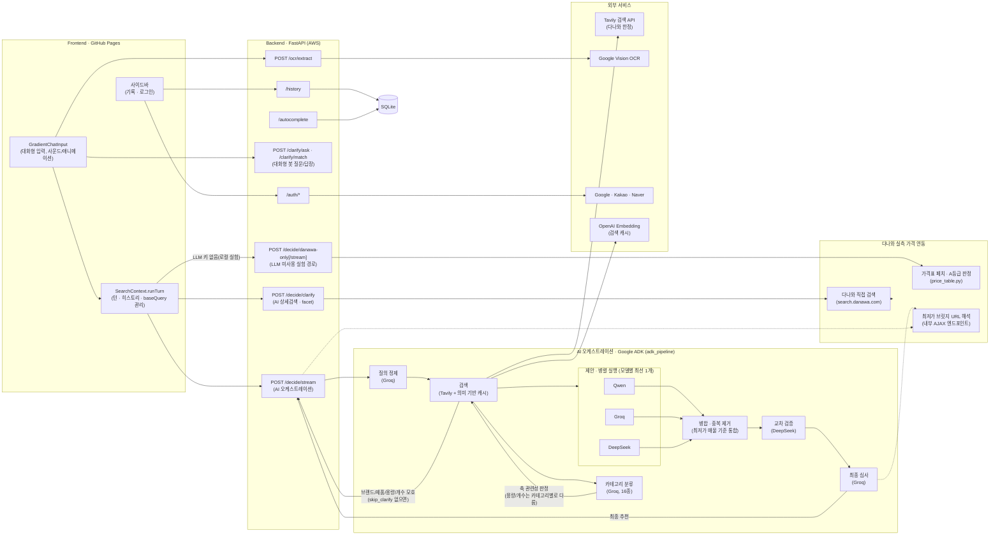
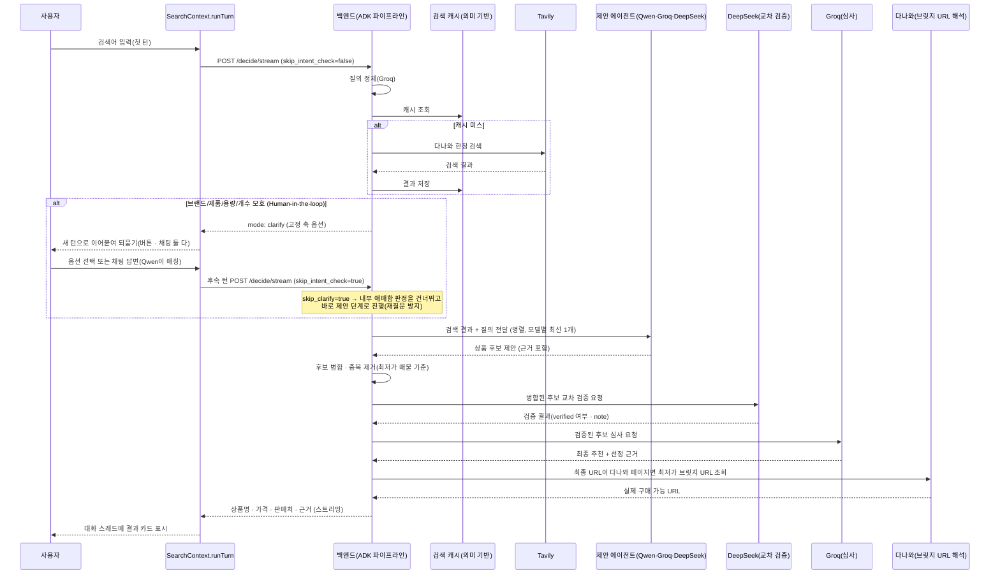

# αlpha Pick

https://alpha-pick00.github.io/

---

## 1️⃣ 프로젝트 개요

### 프로젝트명 및 한 줄 소개

**αlpha Pick** — 하나의 검색어를 여러 AI 에이전트가 각자 조사해 제안하고, 별도의 심사 에이전트가 근거를 비교해 하나의 답으로 압축해주는 멀티에이전트 쇼핑 가격비교 서비스.

### 프로젝트 개요도

> 2026-08 통합 병합 이후 구조. 프론트는 GPT가 실시간으로 응답을 생성하는 대화형 멀티턴
> UI(`ChatTurn`)로, 백엔드는 ADK 기반 멀티에이전트 오케스트레이션과 다나와 실측 가격
> 연동을 함께 갖췄다. Human-in-the-loop도 두 갈래(카테고리 기반 고정 축 + AI 상세검색
> facet)를 상황에 따라 병행한다. 자세한 배경은 [주요 의사결정 사항](#주요-의사결정-사항)
> 참고.

### 적용 기술 스택

| 영역 | 스택 |
| --- | --- |
| Frontend | React 18, Vite 6, TypeScript, Tailwind CSS v4, Framer Motion(`motion`), React Router (HashRouter) |
| Backend | FastAPI, Python, httpx, PyJWT |
| 멀티에이전트 오케스트레이션 | Google ADK(`SequentialAgent`/`ParallelAgent`), LiteLLM |
| AI / 제안 · 검증 · 심사 | Qwen(DashScope) · Groq(Llama) · DeepSeek — 병렬 제안(모델별 최선 1개) / DeepSeek — 교차 검증(challenge) / Groq(GPT-OSS) — 최종 심사(judge) |
| 검색 | Tavily Search API (다나와로 도메인 한정) + 임베딩 기반 의미 유사도 검색 캐시 |
| 다나와 실측 가격 연동 | 다나와 직접 검색/상세페이지 페치(`httpx` + `BeautifulSoup4`/`lxml`), 내부 AJAX 엔드포인트를 통한 최저가 판매처 브릿지 URL 해석 |
| Human-in-the-loop | ① 카테고리 기반 고정 축(브랜드·제품·용량·개수, Groq 16종 분류 연동) ② AI 상세검색 facet(DeepSeek, 상호 교차 필터링) — 상황에 따라 병행, 대화형 질문/답장은 Qwen이 실시간 생성 |
| 이미지 인식 | Google Cloud Vision (텍스트 추출) → Groq (정제 · 검색어 추출) |
| 인증 | Google / Kakao / Naver OAuth2 + JWT 기반 세션 |
| 저장소 | SQLite (검색 기록 · 자동완성 인덱스 · 검색 캐시) |
| 배포 | Docker, nginx, certbot, AWS GPU 인스턴스, nip.io / GitHub Pages(Frontend), GitHub Actions(CI) |

### 주제 선정 배경

쇼핑을 위해 여러 플랫폼 탭을 오가며 가격을 직접 비교해야 하는 번거로움에서 출발했다. 단순히 최저가를 나열하는 비교 서비스가 아니라, "왜 이 상품인지" 근거를 함께 제시하는 서비스를 목표로 했고, 하나의 LLM에만 의존할 경우 생기는 편향·환각 문제를 줄이기 위해 **여러 모델이 각자 조사해 제안하고, 별도 모델이 심사하는 멀티에이전트 구조**를 채택했다.

### 목표 및 기대효과

- 여러 쇼핑몰을 직접 비교하는 시간을 줄이고, 근거가 붙은 단일 추천으로 의사결정을 단순화
- 단일 모델 호출 대비, 여러 모델의 교차 검증을 통해 추천의 신뢰도를 높임
- 텍스트뿐 아니라 상품 사진(OCR)으로도 검색이 가능해 입력 장벽을 낮춤

### 팀원 구성 및 역할 분담

| 팀원 | 주요 역할 |
| --- | --- |
| parkikk (patrick01053457926@gmail.com) | 백엔드 멀티에이전트 토론 엔진, 검색 품질(Tavily 연동/필터링), 소셜 로그인, 배포(AWS/Docker/nginx), 프론트엔드 UI/UX 전반 |
| tmdals3000 | 검색어 자동완성(cold-start) 기능, 멀티턴 대화 기능 |
| lou0-ux | OCR 텍스트 추출 파이프라인(Google Vision + Groq 정제) |

### 주요 의사결정 사항

- **검색 데이터 소스**: Google Merchant API는 자사 등록 상품만 조회 가능해 제3자 가격 비교에 부적합하다고 판단, **Tavily 검색 API + 국내 리테일러 15곳 도메인 한정**으로 전환
- **판단 구조**: 단일 모델 호출 대신 **ChatGPT · Gemini · DeepSeek 3개 모델이 병렬로 제안 → Claude가 근거를 심사**하는 4단계 구조 채택
- **Google 로그인 방식**: 공식 렌더 버튼(iframe)은 Kakao/Naver와 스타일을 맞추기 어려워, `google.accounts.oauth2` 토큰 클라이언트 팝업 방식 + 커스텀 버튼으로 전환
- **CORS 정책**: 인증이 필요 없는 API이지만, 유료 LLM 호출 비용이 드는 만큼 origin을 알려진 도메인으로만 제한(와일드카드 금지)
- **검색 기록 저장**: 로그인 시 계정별 서버(SQLite) 저장, 비로그인 시 브라우저 로컬(localStorage) 저장으로 분기
- **판단 구조 재설계(역할 분리형 에이전트 체인)**: 멘토 피드백(데이터 신뢰도 · 토론/지연시간 구조)을 반영해, 한 번의 호출로 검색부터 추천까지 처리하던 구조를 Google ADK 기반의 **정제 → 검색 → 제안(3모델 병렬, 모델별 최선 1개) → 병합 → 교차 검증 → 심사** 단계로 명시적으로 분리
- **후보 병합 기준**: 여러 모델이 제안한 동일 상품 후보를 병합할 때 가격 · 판매처 · URL을 필드별로 각각 다수결 처리하면 서로 다른 상품의 필드가 섞일 수 있어, **하나의 최저가 매물(cheapest member) 기준으로 가격 · 판매처 · URL을 함께** 채택하도록 변경 — 최종 추천이 항상 실제로 그 가격에 구매 가능한 하나의 URL을 가리키도록 보장
- **Human-in-the-loop 도입 방식**: ADK 내부 pause/resume(`long_running_tool_ids` + `FunctionResponse` 재주입)은 커스텀 `BaseAgent` 구조에서 검증되지 않고 세션 영속화가 필요해 리스크가 크다고 판단, 대신 **앱 레벨에서 파이프라인을 완전히 무상태로 나눠 재실행**하는 방식을 채택(별도 세션 저장소 불필요) — 검색 직후 브랜드 · 제품 · 용량 · 개수가 모호하면 파이프라인을 멈추고, 사용자에게 한 축씩 되물어 이미 답한 조건은 다시 묻지 않는다
- **카테고리 기반 HITL 축 최적화**: "음료가 아닌 식품에도 용량을 묻는다" 같은 무의미한 질문이 상품 매핑 정확도를 떨어뜨려, Gemini로 검색어를 16개 대분류로 분류하고 카테고리별로 용량 · 개수 축의 관련성을 다르게 판정하도록 개선(예: 식품 중 음료만 용량이 유효, 도서는 용량 없이 개수만 유효) — clarify 단계에서만 호출해 지연시간 영향 최소화
- **다나와 실측 가격 직접 연동**: LLM이 제안한 가격 · URL은 검색 스니펫 기반 추정이라 오차가 있을 수 있어, 다나와 검색결과/상세페이지를 직접 페치해 A등급(구매 링크 생성 가능) 판매처 실측가를 별도로 확보 — 최종 추천이 다나와 데이터와 대조 가능하면 `price_source`를 `danawa_offer`로 표시해 신뢰도를 구분
- **다나와 가격비교 페이지 → 실제 구매 URL 변환**: 다나와 상세페이지 자체는 여러 판매처를 나열만 할 뿐 바로 구매할 수 있는 곳이 아니어서(`/bridge/loadingBridge.html?cmpnyc=...`), 최종 응답 URL이 다나와 페이지면 서버가 내부 AJAX 엔드포인트(`getAllPriceCompareMallList.ajax.php`)로 최저가 판매처 브릿지 URL을 조회해 바꿔치기
- **검색 도메인 15곳 → 다나와로 축소**: 15개 리테일러 각각 페이지 구조가 달라 스니펫만 보고 파싱하면 엉뚱한 상품 · 가격이 섞이는 문제가 있었음 — 다나와는 그 자체로 여러 판매처 가격을 한 페이지에서 비교해주는 가격비교 사이트라 도메인을 좁혀 일관성 · 정확도를 우선함(한때 이중화 목적으로 에누리를 함께 검색 범위에 넣었으나, 어댑터 없이 노출만 되던 상태라 최종적으로 비교 대상에서 제외)
- **Human-in-the-loop 이원화(고정 축 + AI 상세검색 facet)**: 두 팀이 각자 발전시킨 clarify 방식(카테고리 기반 고정 4축 · GPT / 다나와 검색 결과 기반 동적 facet · DeepSeek, 상호 교차 필터링)이 서로 다른 강점을 가져 하나를 버리지 않고 병행 — 짧고 애매한 검색어는 먼저 AI 상세검색(facet)을 시도하고, facet이 못 찾으면 AI 오케스트레이션 내부의 고정 축 clarify로 폴백
- **대화형 UI로 통합(멀티턴 `ChatTurn`)**: 첫 검색어부터 이후의 모든 되묻기 · 재검색까지 하나의 성장하는 대화 스레드로 보이도록 프론트를 `ChatTurn` 배열 기반으로 재구성 — 브랜드/facet/고정 축 선택은 전부 새 턴을 만드는 방식으로 통일하고, 봇의 질문 · 답장은 고정 문구가 아니라 GPT가 매번 실제로 생성
- **AI 오케스트레이션과 다나와 통합의 병합**: 같은 기능(멀티에이전트 토론 + 다나와 연동 + HITL + 대화형 UI)을 두 갈래로 독립 개발한 뒤 병합하면서, ADK 파이프라인을 정식 오케스트레이션으로 유지하고 다나와 후보를 judge 풀에 직접 주입하는 직접-구현 경로는 `run_single_debate_price_table_variant`로 보존만 해두고 아직 ADK 파이프라인에 이식하지 않음(후속 과제) — 병합 도중 실제 구동 테스트에서 "이미 답한 축을 다시 묻는" 회귀를 발견해 `skip_clarify` 플래그로 즉시 수정
- **"gpt" 슬롯을 GPT → Qwen으로 교체**: OpenAI 토큰이 소진돼 `agents/gpt.py`가 호출하는 실제 모델을 DashScope(Alibaba Cloud) 기준 최상위 모델인 Qwen으로 바꿈 — `agent="gpt"`라는 내부 식별자(스키마의 `AgentName` 리터럴, 프론트엔드 타입, 테스트 픽스처 등 수십 곳에 걸침)는 그대로 두고 내부에서 호출하는 모델만 교체(파일명·함수명도 유지, `AsyncOpenAI` SDK를 DashScope의 OpenAI 호환 엔드포인트로 base_url만 바꿔 재사용 - `agents/deepseek.py`와 동일한 패턴). 사용자에게 보이는 이름만 프론트엔드 `AGENT_LABEL`에서 "Qwen"으로 변경. `openai_api_key`는 임베딩 기반 검색 캐시에서만 계속 쓰임
- **Gemini · Claude → Groq(무료 API)로 교체**: Gemini 프로젝트가 403으로 막히고 Anthropic엔 상시 무료 티어가 없어, DeepSeek/Qwen을 뺀 나머지 전부를 무료 API인 Groq로 전환 — `agent="gemini"` 식별자와 `agents/gemini.py`/`agents/judge.py` 파일·함수명은 그대로 두고 호출 모델만 교체(Qwen 때와 동일한 패턴). 역할별로 다른 모델을 쓰는데, ADK의 구조화 출력(`output_schema`→`response_format=json_schema`)을 지원하는 모델이 Groq 카탈로그에 `gpt-oss` 계열뿐이라 refine(작은 프롬프트)은 `gpt-oss-20b`, judge(그보다 큰 프롬프트 · 최종 심사)는 `gpt-oss-120b`를 쓰고, 구조화 출력이 필요 없는 categorize/OCR정제/propose의 "gemini" 슬롯은 무료 티어 분당 토큰(TPM) 한도가 가장 넉넉한 `llama-3.3-70b-versatile`을 쓴다 — `groq/compound(-mini)`는 TPM은 넉넉했지만 내부적으로 여러 모델에 요청을 위임하는 에이전틱 모델이라 하위 모델 rate limit을 그대로 물려받아 오히려 더 자주 실패해 제외. 검색 결과 12건을 그대로 프롬프트에 넣으면(Tavily 스니펫 건당 최대 1500자) 이 TPM 한도를 매번 초과해, `format_results_block`이 스니펫을 500자로 잘라 담도록 함께 수정(Qwen/DeepSeek 쪽 프롬프트 비용도 동반 절감)
- **다나와 A등급 실측가 주입을 ADK 파이프라인으로 포팅**: `run_single_debate_price_table_variant`(PART 4-2)에만 있던 "다나와 실측가를 judge 후보 풀에 직접 추가"를 라이브 파이프라인(`adk_pipeline`)에 이식 — `_DanawaFetchNode`를 gpt/gemini/deepseek와 같은 `ParallelAgent`(propose) 소속으로 추가해 동시 실행되게 하고(지연시간 추가 없음), 그 결과를 다른 3개 슬롯과 동일한 raw JSON 모양으로 만들어 기존 `_merge_proposals`/`merge_candidates`에 그대로 태워 `proposed_by` 합의 신호도 같이 얻는다(레거시처럼 별도 merge를 다시 안 돌림). 다나와 데이터는 이미 실측 검증된 값이라 DeepSeek 텍스트 검증에 다시 맡기지 않고, 병합된 후보의 `proposed_by`에 `"danawa"`가 있으면 `_apply_challenge`가 verified를 무조건 True로 강제한다. judge 확정 후에는 `enrich_decision`/`exclude_price_comparison_site_as_final_pick`을 그대로 재사용해 이름이 맞으면 실측가로 덮어쓰고, 최종 URL이 다나와 가격비교 페이지 자체면 치환한다 — 이 작업 전까지 `DecideResponse.price_table`은 라이브 경로에서 항상 null이었다.

### 문제 해결 내역 (Troubleshooting)

- **검색 품질 저하**: 검색 결과에 실제 판매 페이지가 아닌 목록/콘텐츠 페이지가 섞이는 문제를 도메인 화이트리스트 + 제네릭 목록 URL 정규식 필터링 + 브랜드-URL 일치 검증으로 해결
- **정규식 오탐**: `search.shopping.naver.com`이 제네릭 목록 URL로 잘못 필터링되던 문제를 부정 후방탐색(negative lookbehind)으로 수정
- **동일 상품 병합 시 필드 불일치**: 여러 모델이 제안한 동일 상품을 병합할 때 가격 · URL · 판매처를 필드별로 독립적으로 다수결 처리해 "이 가격인데 URL은 다른 상품" 식의 불일치가 발생 → 최저가 매물 하나에서 가격 · URL · 판매처를 함께 채택하도록 수정
- **Human-in-the-loop 선택이 수렴하지 않음**: 사용자가 이미 답한 조건(개수 등)을 매 검색마다 검색 결과에서 새로 추출해, 결과가 여전히 여러 값을 보여주면 같은 질문을 반복하던 문제 → 질의 텍스트에 이미 반영된 조건은 재추출 결과와 무관하게 확정된 것으로 취급하도록 수정
- **자동완성 추천창이 결과 화면 뒤에 남음**: 검색 상태(idle/loading/done)와 무관하게 질의(query) 변경 시마다 자동완성이 다시 열려, HITL 단계 선택이나 완료된 결과 뒤에 추천창이 남아있던 문제 → idle 상태일 때만 노출되도록 수정
- **멀티턴 드릴다운이 수렴하지 않음(2026-08 통합 병합)**: 프론트가 대화형 멀티턴 오케스트레이션 호출로 전환된 뒤, 브랜드 · facet · 고정 축을 이미 선택해 후속 턴으로 넘어갔는데도 ADK 파이프라인 내부의 애매함 판정(`_is_ambiguous`)이 요청의 `skip_intent_check` 플래그와 무관하게 매번 다시 동작해 같은 질문이 무한 반복되던 문제 → `skip_clarify` 플래그를 `main.py` → `run_single_debate(_stream)` → `adk_pipeline.run(_stream)`까지 관통시켜, 후속 턴에서는 내부 조기 종료를 건너뛰고 곧장 제안 · 검증 · 심사까지 진행하도록 수정(완전히 후보가 없을 때의 안전망 clarify는 그대로 유지)

---

## 2️⃣ Project 과정 기록

### 프로젝트 목표 및 배경

여러 쇼핑몰의 가격을 일일이 비교하는 수고를 없애고, 근거가 있는 단일 추천을 제공하는 것이 목표. (배경은 [1️⃣ 주제 선정 배경](#주제-선정-배경) 참고)

### 데이터 소스 및 탐색

- **검색 데이터**: Tavily Search API를 통해 실시간으로 조회, 다나와 도메인으로 한정(원래 국내 리테일러 15곳이었으나, 사이트마다 페이지 구조가 달라 스니펫만으로 파싱하면 엉뚱한 상품이 섞이는 문제로 가격비교 사이트 하나로 축소)
- **다나와 실측 데이터**: 다나와 검색결과/상세페이지를 직접 페치해 판매처별 가격 · 배송정보 · 구매 링크 가능 여부(A/B등급)를 파싱, 내부 AJAX 엔드포인트로 최저가 판매처의 실제 구매 URL까지 확보
- **이미지 데이터**: 사용자가 업로드한 상품 사진 → Google Cloud Vision으로 텍스트 추출

### 전처리(검색 결과 정제) 방법

- 상품 상세/가격 정보가 없는 콘텐츠·매거진·검색결과 목록 도메인 제외 (`EXCLUDE_DOMAINS`)
- 정규식 기반 제네릭 목록 URL 필터링 (`is_generic_listing_url`)
- 브랜드-URL 그라운딩 검증으로 무관한 상품이 섞이는 것을 방지
- OCR 원문에서 가격/바코드/프로모션 문구를 제거하고 상품명·용량 등 핵심 메타데이터만 남기는 Groq 정제 단계(`search_query` 추출)

### 평가 기준 (무엇으로 "좋은 답"을 판단할지)

- 실제 판매 중인 상품 페이지 URL인지 (목록/콘텐츠 페이지 배제)
- 검색어의 브랜드·상품과 실제 반환된 상품이 일치하는지
- 최종 추천에 가격·판매처·선정 근거가 모두 포함되는지

### 베이스라인 대비 개선

단일 LLM 호출(베이스라인) 대비, 3개 제안 모델 + 1개 심사 모델의 멀티에이전트 구조를 통해 한 모델의 편향·환각이 곧바로 최종 답이 되는 것을 방지하도록 설계했다.

### 아키텍처 (역할 분리형 에이전트 파이프라인 · Google ADK)

짧고 애매한 검색어(예: "핸드폰")는 위 흐름 전에 `POST /decide/clarify`(다나와 검색 결과 기반 동적 facet, DeepSeek)를 먼저 시도하고, facet을 못 찾으면 그대로 `/decide/stream` 경로로 넘어간다.

### 트러블슈팅

[1️⃣ 문제 해결 내역](#문제-해결-내역-troubleshooting) 참고.

### 성능/품질 개선 기록

- 검색 도메인을 다나와로 좁혀 신뢰도 낮은 결과 원천 차단(가격비교 사이트 특성상 여러 판매처를 한 페이지에서 일관된 구조로 비교 가능)
- 제네릭 목록 URL·브랜드 불일치 필터링으로 "판매 페이지로 연결되지 않는" 문제 해결
- OCR 결과를 원문 그대로 검색하지 않고 정제된 `search_query`만 사용해 검색 적중률 개선
- 검색 캐시를 정확 일치(exact-key) 방식에서 **임베딩 기반 의미 유사도 매칭**으로 업그레이드해, 표현만 다른 유사 질의의 중복 Tavily/LLM 호출 비용을 절감
- 동일 상품 후보 병합 시 가격 · 판매처 · URL을 최저가 매물 하나에서 함께 채택하도록 바꿔 "가격과 실제 연결 URL이 다른 상품" 불일치 제거
- 제안/교차 검증 프롬프트에 브랜드 · 제품 · 용량 · 개수 정확 일치 조건을 명시해, Human-in-the-loop으로 이미 좁힌 조건이 검색 품질 문제로 다시 섞이지 않도록 개선
- 카테고리별로 용량 · 개수 축의 관련성을 다르게 판정해(Groq 16종 분류), 해당 없는 축을 억지로 고르게 해 상품 매핑이 틀어지는 문제 감소
- AI 상세검색(facet) 다중 라운드 시 base_query를 유지해 다나와 검색 캐시(1시간, 10초 crawl-delay)를 재사용하도록 개선해 드릴다운 응답속도 단축
- 다나와 실측 최저가를 별도로 확보해 LLM 추정 가격 · URL의 오차를 줄이고, 최종 URL이 다나와 가격비교 페이지 자체로 남지 않도록 실제 구매처 브릿지 URL로 항상 변환
- 멀티턴 대화 흐름에서 후속 턴에 `skip_clarify`를 적용해, 이미 답한 조건에 대해 파이프라인이 다시 되묻는 무한 재질문을 제거

### 코드 정리 및 GitHub 관리

- 기능 단위 브랜치 → PR → 리뷰(빌드/타입체크) → merge 워크플로를 일관되게 적용 (PR #1~#25)
- 병합 완료된 브랜치는 주기적으로 감사(merge-base 확인) 후 정리해 브랜치 목록을 최신 상태로 유지
- `.env`, SQLite 데이터 파일(`autocomplete.db`, `history.db`) 등 비밀/로컬 데이터는 `.gitignore`로 관리

### 한계점 및 향후 과제

- Google Merchant API는 자사 상품 피드만 조회 가능해 제3자 가격 비교에는 활용하지 못함
- 카카오 로그인은 REST API 키 설정을 완료했으나, 실사용 트래픽 기준의 검증은 아직 진행 전
- 정성적 검증 위주로 진행되어, 정량적 지표(응답 정확도·지연 시간 등) 기반의 자동화된 평가 체계는 부재
- 현재는 다나와 하나로 한정된 검색 범위를 점진적으로 확장할 여지가 있음
- Google ADK가 출시 초기 버전(`SequentialAgent`/`ParallelAgent`가 이미 deprecated 표시)이라, 향후 문서가 더 풍부한 `Workflow`/`@node` API로의 이전을 검토할 필요가 있음
- Human-in-the-loop을 앱 레벨의 무상태 재실행(파이프라인을 처음부터 다시 실행)으로 구현해 단계마다 정제/검색 비용이 다시 발생함 — ADK 세션 기반의 내부 pause/resume으로 전환하면 절감 가능
- 고정 축 clarify(GPT)와 AI 상세검색 facet(DeepSeek)이 서로 다른 팀에서 독립적으로 발전해 로직이 완전히 통합되지 않고 병행 운영 중 — 장기적으로는 하나의 clarify 모델로 수렴할 필요가 있음

### 회고

> `[팀 회고 내용 추가]`
