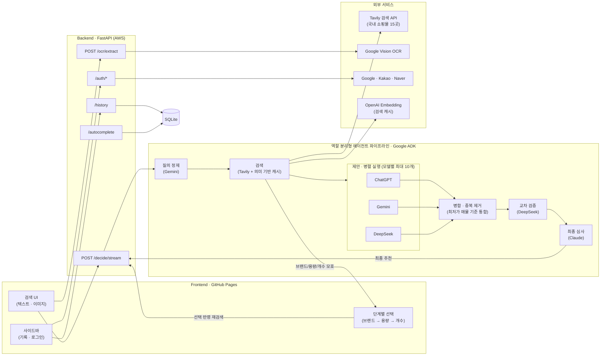
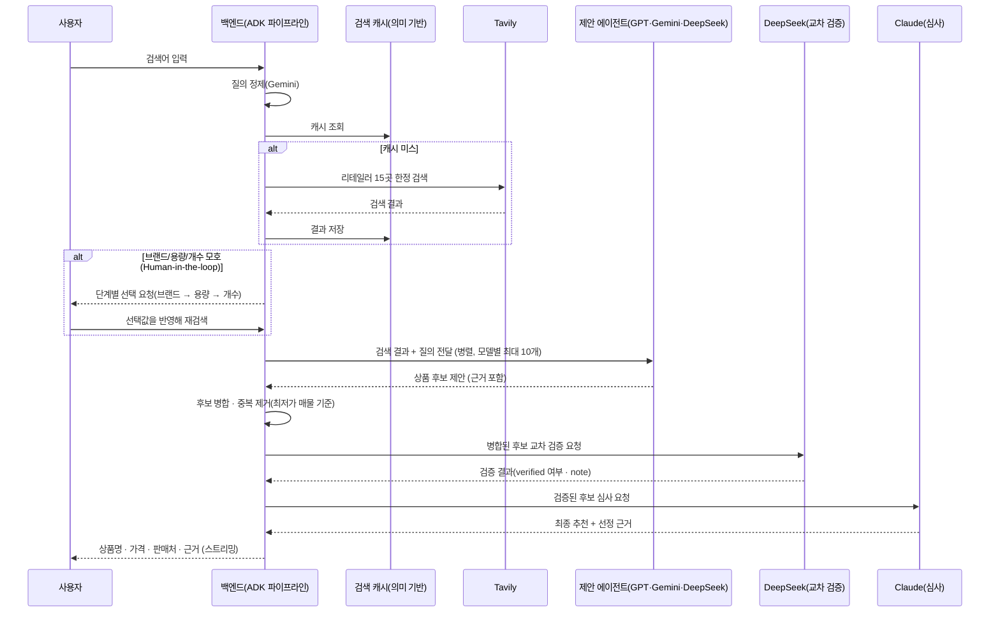

# αlpha Pick

https://alpha-pick00.github.io/

---

## 1️⃣ 프로젝트 개요

### 프로젝트명 및 한 줄 소개

**αlpha Pick** — 하나의 검색어를 여러 AI 에이전트가 각자 조사해 제안하고, 별도의 심사 에이전트가 근거를 비교해 하나의 답으로 압축해주는 멀티에이전트 쇼핑 가격비교 서비스.

### 프로젝트 개요도

### 적용 기술 스택

| 영역 | 스택 |
| --- | --- |
| Frontend | React 18, Vite 6, TypeScript, Tailwind CSS v4, Framer Motion(`motion`), React Router (HashRouter) |
| Backend | FastAPI, Python, httpx, PyJWT |
| 멀티에이전트 오케스트레이션 | Google ADK(`SequentialAgent`/`ParallelAgent`), LiteLLM |
| AI / 제안 · 검증 · 심사 | OpenAI(ChatGPT) · Google Gemini · DeepSeek — 병렬 제안(모델별 최대 10개) / DeepSeek — 교차 검증(challenge) / Anthropic Claude — 최종 심사(judge) |
| 검색 | Tavily Search API (국내 리테일러 15곳으로 도메인 한정) + 임베딩 기반 의미 유사도 검색 캐시 |
| 이미지 인식 | Google Cloud Vision (텍스트 추출) → Gemini (정제 · 검색어 추출) |
| 인증 | Google / Kakao / Naver OAuth2 + JWT 기반 세션 |
| 저장소 | SQLite (검색 기록 · 자동완성 인덱스 · 검색 캐시) |
| 배포 | Docker, nginx, certbot, AWS GPU 인스턴스, nip.io / GitHub Pages(Frontend), GitHub Actions(CI) |

### 주제 선정 배경

쇼핑을 위해 여러 플랫폼 탭을 오가며 가격을 직접 비교해야 하는 번거로움에서 출발했다. 단순히 최저가를 나열하는 비교 서비스가 아니라, "왜 이 상품인지" 근거를 함께 제시하는 서비스를 목표로 했고, 하나의 LLM에만 의존할 경우 생기는 편향·환각 문제를 줄이기 위해 **여러 모델이 각자 조사해 제안하고, 별도 모델이 심사하는 멀티에이전트 구조**를 채택했다.

### 목표 및 기대효과

- 여러 쇼핑몰을 직접 비교하는 시간을 줄이고, 근거가 붙은 단일 추천으로 의사결정을 단순화
- 단일 모델 호출 대비, 여러 모델의 교차 검증을 통해 추천의 신뢰도를 높임
- 텍스트뿐 아니라 상품 사진(OCR)으로도 검색이 가능해 입력 장벽을 낮춤

### 팀원 구성 및 역할 분담

| 팀원 | 주요 역할 |
| --- | --- |
| parkikk (patrick01053457926@gmail.com) | 백엔드 멀티에이전트 토론 엔진, 검색 품질(Tavily 연동/필터링), 소셜 로그인, 배포(AWS/Docker/nginx), 프론트엔드 UI/UX 전반 |
| tmdals3000 | 검색어 자동완성(cold-start) 기능 |
| lou0-ux | OCR 텍스트 추출 파이프라인(Google Vision + Gemini 정제) |

### 주요 의사결정 사항

- **검색 데이터 소스**: Google Merchant API는 자사 등록 상품만 조회 가능해 제3자 가격 비교에 부적합하다고 판단, **Tavily 검색 API + 국내 리테일러 15곳 도메인 한정**으로 전환
- **판단 구조**: 단일 모델 호출 대신 **ChatGPT · Gemini · DeepSeek 3개 모델이 병렬로 제안 → Claude가 근거를 심사**하는 4단계 구조 채택
- **Google 로그인 방식**: 공식 렌더 버튼(iframe)은 Kakao/Naver와 스타일을 맞추기 어려워, `google.accounts.oauth2` 토큰 클라이언트 팝업 방식 + 커스텀 버튼으로 전환
- **CORS 정책**: 인증이 필요 없는 API이지만, 유료 LLM 호출 비용이 드는 만큼 origin을 알려진 도메인으로만 제한(와일드카드 금지)
- **검색 기록 저장**: 로그인 시 계정별 서버(SQLite) 저장, 비로그인 시 브라우저 로컬(localStorage) 저장으로 분기
- **판단 구조 재설계(역할 분리형 에이전트 체인)**: 멘토 피드백(데이터 신뢰도 · 토론/지연시간 구조)을 반영해, 한 번의 호출로 검색부터 추천까지 처리하던 구조를 Google ADK 기반의 **정제 → 검색 → 제안(3모델 병렬, 모델별 최대 10개) → 병합 → 교차 검증 → 심사** 단계로 명시적으로 분리
- **후보 병합 기준**: 여러 모델이 제안한 동일 상품 후보를 병합할 때 가격 · 판매처 · URL을 필드별로 각각 다수결 처리하면 서로 다른 상품의 필드가 섞일 수 있어, **하나의 최저가 매물(cheapest member) 기준으로 가격 · 판매처 · URL을 함께** 채택하도록 변경 — 최종 추천이 항상 실제로 그 가격에 구매 가능한 하나의 URL을 가리키도록 보장
- **Human-in-the-loop 도입 방식**: ADK 내부 pause/resume(`long_running_tool_ids` + `FunctionResponse` 재주입)은 커스텀 `BaseAgent` 구조에서 검증되지 않고 세션 영속화가 필요해 리스크가 크다고 판단, 대신 **앱 레벨에서 파이프라인을 완전히 무상태로 나눠 재실행**하는 방식을 채택(별도 세션 저장소 불필요) — 검색 직후 브랜드 · 용량 · 개수가 모호하면 파이프라인을 멈추고, 사용자에게 브랜드 → 용량 → 개수 순으로 한 단계씩 되물어 이미 답한 조건은 다시 묻지 않는다

### 문제 해결 내역 (Troubleshooting)

- **검색 품질 저하**: 검색 결과에 실제 판매 페이지가 아닌 목록/콘텐츠 페이지가 섞이는 문제를 도메인 화이트리스트 + 제네릭 목록 URL 정규식 필터링 + 브랜드-URL 일치 검증으로 해결
- **정규식 오탐**: `search.shopping.naver.com`이 제네릭 목록 URL로 잘못 필터링되던 문제를 부정 후방탐색(negative lookbehind)으로 수정
- **동일 상품 병합 시 필드 불일치**: 여러 모델이 제안한 동일 상품을 병합할 때 가격 · URL · 판매처를 필드별로 독립적으로 다수결 처리해 "이 가격인데 URL은 다른 상품" 식의 불일치가 발생 → 최저가 매물 하나에서 가격 · URL · 판매처를 함께 채택하도록 수정
- **Human-in-the-loop 선택이 수렴하지 않음**: 사용자가 이미 답한 조건(개수 등)을 매 검색마다 검색 결과에서 새로 추출해, 결과가 여전히 여러 값을 보여주면 같은 질문을 반복하던 문제 → 질의 텍스트에 이미 반영된 조건은 재추출 결과와 무관하게 확정된 것으로 취급하도록 수정
- **자동완성 추천창이 결과 화면 뒤에 남음**: 검색 상태(idle/loading/done)와 무관하게 질의(query) 변경 시마다 자동완성이 다시 열려, HITL 단계 선택이나 완료된 결과 뒤에 추천창이 남아있던 문제 → idle 상태일 때만 노출되도록 수정

---

## 2️⃣ Project 과정 기록

### 프로젝트 목표 및 배경

여러 쇼핑몰의 가격을 일일이 비교하는 수고를 없애고, 근거가 있는 단일 추천을 제공하는 것이 목표. (배경은 [1️⃣ 주제 선정 배경](#주제-선정-배경) 참고)

### 데이터 소스 및 탐색

- **검색 데이터**: Tavily Search API를 통해 실시간으로 조회, 국내 리테일러 15곳(쿠팡·네이버쇼핑·컬리·SSG·G마켓·CJ온스타일·11번가·GS SHOP·현대홈쇼핑·옥션·알리익스프레스·다이소·롯데홈쇼핑·인터파크·다나와)으로 도메인 한정
- **이미지 데이터**: 사용자가 업로드한 상품 사진 → Google Cloud Vision으로 텍스트 추출

### 전처리(검색 결과 정제) 방법

- 상품 상세/가격 정보가 없는 콘텐츠·매거진·검색결과 목록 도메인 제외 (`EXCLUDE_DOMAINS`)
- 정규식 기반 제네릭 목록 URL 필터링 (`is_generic_listing_url`)
- 브랜드-URL 그라운딩 검증으로 무관한 상품이 섞이는 것을 방지
- OCR 원문에서 가격/바코드/프로모션 문구를 제거하고 상품명·용량 등 핵심 메타데이터만 남기는 Gemini 정제 단계(`search_query` 추출)

### 평가 기준 (무엇으로 "좋은 답"을 판단할지)

- 실제 판매 중인 상품 페이지 URL인지 (목록/콘텐츠 페이지 배제)
- 검색어의 브랜드·상품과 실제 반환된 상품이 일치하는지
- 최종 추천에 가격·판매처·선정 근거가 모두 포함되는지

### 베이스라인 대비 개선

단일 LLM 호출(베이스라인) 대비, 3개 제안 모델 + 1개 심사 모델의 멀티에이전트 구조를 통해 한 모델의 편향·환각이 곧바로 최종 답이 되는 것을 방지하도록 설계했다.

### 아키텍처 (역할 분리형 에이전트 파이프라인 · Google ADK)

### 트러블슈팅

[1️⃣ 문제 해결 내역](#문제-해결-내역-troubleshooting) 참고.

### 성능/품질 개선 기록

- 검색 도메인을 15곳으로 한정해 신뢰도 낮은 결과 원천 차단
- 제네릭 목록 URL·브랜드 불일치 필터링으로 "판매 페이지로 연결되지 않는" 문제 해결
- OCR 결과를 원문 그대로 검색하지 않고 정제된 `search_query`만 사용해 검색 적중률 개선
- 검색 캐시를 정확 일치(exact-key) 방식에서 **임베딩 기반 의미 유사도 매칭**으로 업그레이드해, 표현만 다른 유사 질의의 중복 Tavily/LLM 호출 비용을 절감
- 동일 상품 후보 병합 시 가격 · 판매처 · URL을 최저가 매물 하나에서 함께 채택하도록 바꿔 "가격과 실제 연결 URL이 다른 상품" 불일치 제거
- 제안/교차 검증 프롬프트에 브랜드 · 용량 · 개수 정확 일치 조건을 명시해, Human-in-the-loop으로 이미 좁힌 조건이 검색 품질 문제로 다시 섞이지 않도록 개선

### 코드 정리 및 GitHub 관리

- 기능 단위 브랜치 → PR → 리뷰(빌드/타입체크) → merge 워크플로를 일관되게 적용 (PR #1~#25)
- 병합 완료된 브랜치는 주기적으로 감사(merge-base 확인) 후 정리해 브랜치 목록을 최신 상태로 유지
- `.env`, SQLite 데이터 파일(`autocomplete.db`, `history.db`) 등 비밀/로컬 데이터는 `.gitignore`로 관리

### 한계점 및 향후 과제

- Google Merchant API는 자사 상품 피드만 조회 가능해 제3자 가격 비교에는 활용하지 못함
- 카카오 로그인은 REST API 키 설정을 완료했으나, 실사용 트래픽 기준의 검증은 아직 진행 전
- 정성적 검증 위주로 진행되어, 정량적 지표(응답 정확도·지연 시간 등) 기반의 자동화된 평가 체계는 부재
- 현재는 15개 리테일러로 한정된 검색 범위를 점진적으로 확장할 여지가 있음
- Google ADK가 출시 초기 버전(`SequentialAgent`/`ParallelAgent`가 이미 deprecated 표시)이라, 향후 문서가 더 풍부한 `Workflow`/`@node` API로의 이전을 검토할 필요가 있음
- Human-in-the-loop을 앱 레벨의 무상태 재실행(파이프라인을 처음부터 다시 실행)으로 구현해 단계마다 정제/검색 비용이 다시 발생함 — ADK 세션 기반의 내부 pause/resume으로 전환하면 절감 가능

### 회고

> `[팀 회고 내용 추가]`
